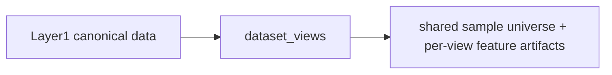

# Dataset Views Flow

## Layer Contract

## Input

- frozen Layer1 canonical history
- frozen Layer1 feature catalog
- Layer1 manifest
- segment manifest when a selected view needs continuity-aware windows
- optional explicit label artifact in `benchmark-ready` mode

## This Layer Does

- materialize the active benchmark feature scope:
  `v0`, `v1`, and explicit `v2` subviews
- provide the full nine-channel source matrix from which downstream
  evaluation selects `base_5`, `plus_ph`, `plus_npk`, or `full_9`
- reject removed `v3`, `v5`, and `v6` family requests at view
  resolution time
- publish one shared sample universe and one shared feature-lineage
  contract so downstream layers read the same rows and feature meanings
- write short artifact guides so the run explains itself in place

It does **not** decide folds, final trainability, or scientific claim
status.

## Output

- run guides
  - `ARTIFACT_GUIDE.md`
  - `shared/README.md`
  - `views/README.md`
- shared sample universe artifacts
  - `shared/row_index.*`
  - `shared/metadata.*`
  - `shared/source_manifest.json`
- shared tranche-0 feature contract artifacts
  - `shared/feature_role_registry.csv`
  - `shared/feature_dependency_closure.parquet`
  - `shared/ablation_view_registry.csv`
- per-view feature artifacts
  - `views/<view_id>/X.*`
  - `views/<view_id>/manifest.json`
  - `views/<view_id>/schema.json`
  - `views/<view_id>/feature_columns.json`
  - `views/<view_id>/feature_lineage.json`
- scope reports
  - `reports/current_scope_taxonomy_report.json`

## Main Handoff

- downstream feature authority for `evaluation_protocols`
- downstream feature-lineage authority for tranche-0 dependency and
  ablation checks
