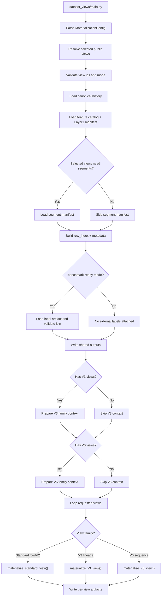

# Dataset Views Flow

## Purpose

`dataset_views` materializes feature matrices from canonical Layer1. It
does not define benchmark folds, does not own label rules, and does not
train models.

## Entrypoint

- CLI:
  - `python Backend/Benchmark/dataset_views/main.py ...`
- Runtime:
  - `main.py -> materialize_dataset_views()`
  - `pipelines/materialize.py`

## Implemented flow

## What comes in

- Layer1 canonical history
- Layer1 feature catalog
- Layer1 manifest
- segment manifest when V2/V3/V6 requires it
- optional explicit label artifact when mode is `benchmark-ready`

## What goes out

- `artifacts/<run_id>/shared/row_index.*`
- `artifacts/<run_id>/shared/metadata.*`
- `artifacts/<run_id>/shared/source_manifest.json`
- `artifacts/<run_id>/views/<view_id>/X.*`
- `artifacts/<run_id>/views/<view_id>/manifest.json`
- `artifacts/<run_id>/views/<view_id>/schema.json`
- family-specific audits for V2/V3/V6

## Folder map

- `pipelines/materialize.py`
  - main orchestration
- `pipelines/runtime.py`
  - taxonomy resolution and request validation
- `pipelines/shared_outputs.py`
  - row index, metadata, and shared run outputs
- `pipelines/standard_views.py`
  - dispatch for row views and V2
- `windowing/`
  - V2 continuity-aware windows
- `row_views/`
  - explicit row matrices for V0 and V1
- `pipelines/v3_family.py` + `lineage/`
  - V3 operational-lineage
- `pipelines/v6_family.py` + `v6_environment/`
  - V6 sequence lane

## Logic boundaries

- view selection and taxonomy live in `configs/` and `runtime.py`
- orchestration lives in `pipelines/`
- domain-family logic lives in `windowing/`, `lineage/`, and
  `v6_environment/`
- file writing lives in `writers/`

## What a maintainer should not infer

- `dataset_views` does not decide benchmark train/validation/test splits
- `dataset_views` does not decide final trainability
- `dataset_views` should not assign scientific meaning to labels

## Read this next

1. `main.py`
2. `pipelines/materialize.py`
3. `pipelines/runtime.py`
4. `pipelines/shared_outputs.py`
5. `pipelines/standard_views.py`
6. `windowing/engine.py`
7. `pipelines/v3_family.py` or `pipelines/v6_family.py` when needed
