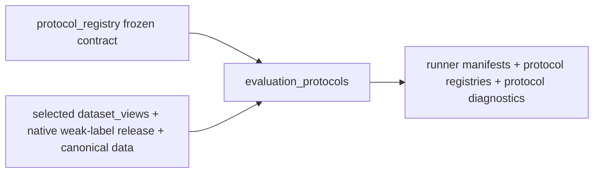

# Evaluation Protocols Flow

## Layer Contract



## Input

- Layer1 canonical history and feature catalog
- segment manifest
- one `dataset_views` run as feature authority
- one `weak_labels` run as label authority
- one explicit non-Phase-A `protocol_registry` run as environment and
  permission authority
- one explicit execution profile selecting label/train/evaluation/target
  environments

## This Layer Does

- consume benchmark environments from the upstream registry
- filter the run to the execution profile before building manifests
- decide which rows belong to which training or evaluation protocol
- build the runner-facing manifests consumed by `model_suite`
- resolve semantic feature arms from one materialized full matrix and pin
  the ordered allowlist plus its hash in every training manifest
- publish the tranche-0 scientific contract artifacts such as
  environment registry, claim registry, comparison registry, and digest
  proofs
- keep `8h` history diagnostics available without making them part of
  the default public benchmark runner scope

It remains runner-protocol authority but no longer owns environment facts.
Phase-A-only registries trigger a hard STOP before this lane creates a run.
It does **not** train models.

For an E1-only RQ1 run:

```powershell
python Backend/Benchmark/evaluation_protocols/main.py `
  --protocol-registry-run-dir <native-child-registry> `
  --protocol-stage-id CONTRACT_FROZEN `
  --dataset-views-run-dir <dataset-views-run> `
  --native-label-release-dir <native-label-release> `
  --execution-profile Backend/Benchmark/evaluation_protocols/profiles/rq1_e1_only.yaml
```

E2/E3 runs require a different predeclared profile and a native label release
covering every requested environment; they are not implicitly joined to RQ1.

The legacy `v2` alias is compatibility-only and expands to the primary 3h
minimal and full history views. Any 8h run must request
`v2_minimal_sensor_window_8h` or `v2_sensor_row_window_8h` explicitly.

## Output

- reader guides
  - `ARTIFACT_GUIDE.md`
  - `run_metadata/README.md`
  - `domain_manifests/README.md`
  - `primary_protocol/README.md`
  - `primary_protocol/runner/README.md`
- environment and protocol framing
  - `domain_manifests/deployment_domains.csv`
  - `domain_manifests/environment_registry.csv`
  - `domain_manifests/sample_environment_manifest.parquet`
  - `domain_manifests/e1_fold_registry.csv`
- legacy runner contract outputs
  - `primary_protocol/runner/task_view_registry.csv`
  - `primary_protocol/runner/task_training_manifest.parquet`
  - `primary_protocol/runner/comparison_training_manifest.parquet`
  - `primary_protocol/runner/frozen_target_manifest.parquet`
  - `primary_protocol/runner/runner_contract.json`
- tranche-0 runner contract outputs
  - `primary_protocol/runner/discovery_training_manifest.parquet`
  - `primary_protocol/runner/temporal_falsification_manifest.parquet`
  - `primary_protocol/runner/source_expansion_operational_manifest.parquet`
  - `primary_protocol/runner/source_expansion_matched_budget_manifest.parquet`
  - `primary_protocol/runner/deployment_transport_manifest.parquet`
  - `primary_protocol/runner/runner_contract_v2.json`
- tranche-0 registries
  - `run_metadata/claim_registry.yaml`
  - `run_metadata/comparison_registry.csv`
  - `run_metadata/experiment_registry.csv`
  - `run_metadata/legacy_to_v2_equivalence_report.csv`
- protocol diagnostics

## Main Handoff

- downstream protocol authority for `model_suite`
- downstream experiment and claim registry authority for
  `validity_lifecycle`
