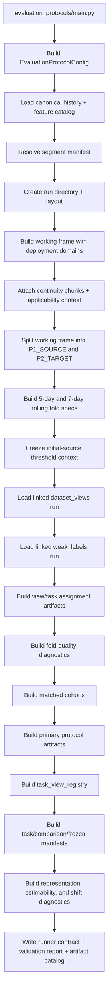

# Evaluation Protocols Flow

## Purpose

`evaluation_protocols` freezes benchmark framing into the runner
contract consumed by `model_suite`. This lane decides which rows are
trainable under which fold, partition, deployment domain, and
comparison scope.

## Entrypoint

- CLI:
  - `python Backend/Benchmark/evaluation_protocols/main.py ...`
- Runtime:
  - `main.py -> build_evaluation_protocols()`
  - `pipeline/build.py`

## Implemented flow

## What comes in

- Layer1 canonical history
- Layer1 feature catalog
- segment manifest
- one `dataset_views` artifact run
- one `weak_labels` artifact run

## What goes out

- `domain_manifests/deployment_domains.csv`
- `primary_protocol/folds/*`
- `primary_protocol/cohorts/*`
- `primary_protocol/runner/task_view_registry.csv`
- `primary_protocol/runner/task_training_manifest.parquet`
- `primary_protocol/runner/comparison_training_manifest.parquet`
- `primary_protocol/runner/frozen_target_manifest.parquet`
- `primary_protocol/runner/runner_contract.json`
- validity, transport, threshold, and dependency diagnostics

## Folder map

- `pipeline/build.py`
  - main orchestration
- `domains/`
  - deployment mapping and threshold freezing
- `lineage/`
  - assignments, matched cohorts, primary protocol selection
- `pipeline/consumption.py`
  - build runner-facing manifests from linked artifacts
- `diagnostics/`
  - representation, estimability, fold support, shift, dependency
- `pipeline/frozen_target.py`
  - build the final source-to-target holdout contract

## The key contract

`model_suite` must not infer train rows directly from `dataset_views` or
`weak_labels`.

It must consume:

- `task_view_registry.csv`
- `task_training_manifest.parquet`
- `comparison_training_manifest.parquet`
- `frozen_target_manifest.parquet`
- `runner_contract.json`

## Read this next

1. `main.py`
2. `pipeline/build.py`
3. `pipeline/consumption.py`
4. `lineage/assignments.py`
5. `lineage/cohorts.py`
6. `pipeline/frozen_target.py`
7. `diagnostics/representation.py`
