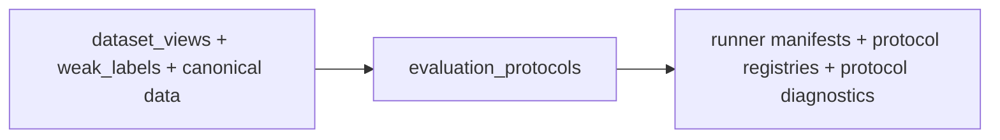

# Evaluation Protocols Flow

## Layer Contract

## Input

- Layer1 canonical history and feature catalog
- segment manifest
- one `dataset_views` run as feature authority
- one `weak_labels` run as label authority

## This Layer Does

- define the benchmark environments and fold semantics
- decide which rows belong to which training or evaluation protocol
- build the runner-facing manifests consumed by `model_suite`
- publish the tranche-0 scientific contract artifacts such as
  environment registry, claim registry, comparison registry, and digest
  proofs
- keep `8h` history diagnostics available without making them part of
  the default public benchmark runner scope

It is the protocol authority. It does **not** train models.

## Output

- reader guides
  - `ARTIFACT_GUIDE.md`
  - `run_metadata/README.md`
  - `domain_manifests/README.md`
  - `primary_protocol/README.md`
  - `primary_protocol/runner/README.md`
- environment and protocol framing
  - `domain_manifests/deployment_domains.csv`
  - `domain_manifests/environment_registry.csv`
  - `domain_manifests/sample_environment_manifest.parquet`
  - `domain_manifests/e1_fold_registry.csv`
- legacy runner contract outputs
  - `primary_protocol/runner/task_view_registry.csv`
  - `primary_protocol/runner/task_training_manifest.parquet`
  - `primary_protocol/runner/comparison_training_manifest.parquet`
  - `primary_protocol/runner/frozen_target_manifest.parquet`
  - `primary_protocol/runner/runner_contract.json`
- tranche-0 runner contract outputs
  - `primary_protocol/runner/discovery_training_manifest.parquet`
  - `primary_protocol/runner/temporal_falsification_manifest.parquet`
  - `primary_protocol/runner/source_expansion_operational_manifest.parquet`
  - `primary_protocol/runner/source_expansion_matched_budget_manifest.parquet`
  - `primary_protocol/runner/deployment_transport_manifest.parquet`
  - `primary_protocol/runner/runner_contract_v2.json`
- tranche-0 registries
  - `run_metadata/claim_registry.yaml`
  - `run_metadata/comparison_registry.csv`
  - `run_metadata/experiment_registry.csv`
  - `run_metadata/legacy_to_v2_equivalence_report.csv`
- protocol diagnostics

## Main Handoff

- downstream protocol authority for `model_suite`
- downstream experiment and claim registry authority for
  `validity_lifecycle`
