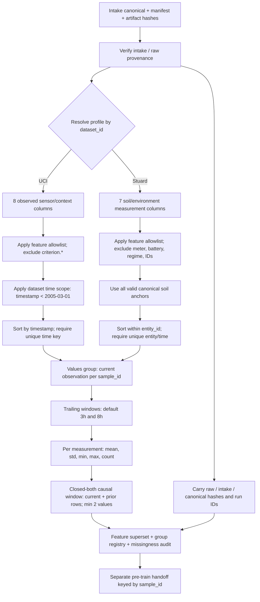

# External Feature Processing Flow



## Feature construction detail

```mermaid
sequenceDiagram
    participant I as Intake canonical
    participant P as Dataset profile
    participant W as Window builder
    participant R as Feature registry
    participant A as Pre-train audit
    I->>P: dataset_id + timestamp/entity/value schema
    P->>W: time keys, allowed measurements, scope, groups
    W->>W: filter scope; stable-sort; reject duplicate time keys
    W->>W: emit values group keyed by sample_id
    loop Each requested horizon (default 3h, 8h)
      W->>W: trailing [t-horizon, t], grouped by entity
      W->>W: compute mean/std/min/max/count; require at least 2 values
    end
    W->>R: superset, feature groups, per-column missingness
    R->>A: registry + source lineage + stable sample keys
```

## Source routing

- Stuard uses the seven declared soil/environment measurements and groups
  histories by irrigation line. Battery, cadence, line/regime, and water-meter
  values remain outside the feature matrix.
- UCI uses a source-code measurement allowlist. Analyzer `(GT)` values remain
  criterion-only and cannot enter the feature matrix, even if a run manifest
  is edited to change a role.
- UCI feature runs apply the documented source period, timestamps strictly
  before 2005-03-01. The canonical intake remains unchanged; the manifest and
  registry record included and excluded row counts and the original endpoint.
- Intake manifests and canonical artifacts are verified against their
  artifact catalog; the raw release manifest hash is also checked and carried
  into the feature registry for pre-train lineage.
- The default output is one wide `feature_superset.parquet`, not one file per
  feature recipe. `feature_group_registry.json` lets the later audit select
  `values`, `window_3h`, `window_8h`, or combinations without recalculating
  features.

The engine rejects duplicate timestamps within an entity because row order
cannot define a causal ordering among equal-time observations. It records the
original canonical row position and includes the current and prior observations
inside each trailing horizon. Missing warm-up statistics stay null. These are
elapsed-time windows, not fixed row-count lookbacks; the manifest records
horizons and minimum count so changes produce a new versioned run.

## Where to change feature processing

| Desired change | Current owner |
|---|---|
| Add a dataset or set its timestamp/entity/measurement allowlist and scope | [profiles.py](profiles.py) |
| Change default horizons or minimum observations | `contracts.py`; explicit CLI overrides are in [main.py](main.py) |
| Change window statistics, causal boundaries, or grouping | [windowing.py](windowing.py) |
| Change persisted groups, manifest, or lineage fields | `persistence.py` |

The window builder only reads columns in the feature profile. Changing a label
target source does not automatically add that source to X.
