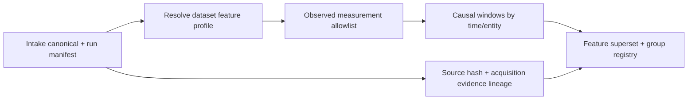

# External Feature Processing Flow

## Source routing

- Stuard uses the seven declared soil/environment measurements and groups
  histories by irrigation line. Battery, cadence, line/regime, and water-meter
  values remain outside the feature matrix.
- UCI uses a source-code measurement allowlist. Analyzer `(GT)` values remain
  criterion-only and cannot enter the feature matrix, even if a run manifest
  is edited to change a role.
- Intake manifests and canonical artifacts are verified against their
  artifact catalog; the raw release manifest hash is also checked and carried
  into the feature registry for pre-train lineage.

The engine rejects duplicate timestamps within an entity because row order
cannot define a causal ordering among equal-time observations. It records the
original canonical row position and includes the current and prior observations
inside each trailing horizon. Missing warm-up statistics stay null.
