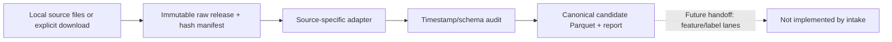

# External Intake Flow

## Layer contract

## Implemented behavior

- The CLI selects a registered external source adapter by `dataset_id`.
- Raw files are placed in a new release folder before parsing. Files are
  byte-for-byte copies of supplied files or downloaded bytes; checksums and
  source URLs are stored in `raw_manifest.json`.
- Stuard streams are joined to soil timestamps using backward as-of joins.
  An eight-minute tolerance limits stale matches. Matched source timestamps,
  age, device identity, battery, and line/regime context are retained.
- Repeated stream-header rows are written to the exclusion table with source
  stream and original row number. Missing or unknown Stuard irrigation lines
  fail validation instead of being pooled into an unknown entity.
- UCI malformed timestamps and wholly empty source rows are written to the
  exclusion table with distinct reasons. The `-200` sentinel is converted to
  missing in the canonical candidate while the raw file remains unchanged.
  Analyzer readings are retained as criterion-only fields.
- Every processing run writes a new timestamped folder and references exact
  raw hashes. Intake does not generate target labels or model-ready X.

## Handoff and limitations

- Output is an additive research candidate, not a promoted Core canonical
  dataset and not an active dataset-view source yet.
- The official UCI source and Stuard GitHub source files have now been
  downloaded and archived in the pack. Full-data adapter/feature runs exist;
  source-specific label/split contracts remain pending.
- The processed UCI export has 9,357 timestamped records and 114 blank source
  rows (not invalid timestamps). Its observed end date is later than the
  published dataset description; resolve this discrepancy before defining
  chronological splits.
- Threshold calibration, persistence labels, causal feature windows,
  pre-training feature selection/audit, and UCI multi-label model execution
  are separate stages not implemented by this intake package.
