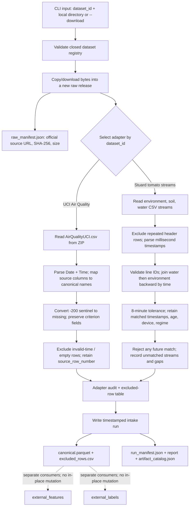

# External Intake Flow

## Layer contract

## Implemented behavior

- The CLI selects a registered external source adapter by `dataset_id`.
- Stuard `--download` reads the three CSV streams from their official Mendeley
  Data Version 2 file URLs (dataset DOI `10.17632/35wh56287y.2`). UCI uses its
  official UCI repository ZIP URL. The exact source URL, size, and SHA-256 are
  recorded in each new raw release manifest.
- Raw files are placed in a new release folder before parsing. Files are
  byte-for-byte copies of supplied files or downloaded bytes; checksums and
  source URLs are stored in `raw_manifest.json`.
- Stuard streams are joined to soil timestamps using backward as-of joins.
  An eight-minute tolerance limits stale matches. Matched source timestamps,
  age, device identity, battery, and line/regime context are retained.
- Repeated stream-header rows are written to the exclusion table with source
  stream and original row number. Missing or unknown Stuard irrigation lines
  fail validation instead of being pooled into an unknown entity.
- UCI malformed timestamps and wholly empty source rows are written to the
  exclusion table with distinct reasons. The `-200` sentinel is converted to
  missing in the canonical candidate while the raw file remains unchanged.
  Analyzer readings are retained in the legacy `criterion.*` namespace with
  explicit `reference_measurement` semantics; CO/NOx references define Y, so
  they are not independent evaluation criteria and never enter X. The adapter's
  `criterion_only` role is an exclusion-from-X guard.
- Every processing run writes a new timestamped folder and references exact
  raw hashes. Intake does not generate target labels or model-ready X.

## What the canonical candidate contains

| Dataset | Row anchor and identity | Processing performed here | Fields retained for later stages |
|---|---|---|---|
| UCI Air Quality | One timestamped hourly source row; `sample_id` includes the original row number. | Parse local wall-clock date/time, normalize column names, map measurement and criterion fields, change `-200` sentinels to missing, record invalid/empty source rows separately, stable-sort by time. | `sensor.*`, `context.*`, `criterion.*`, timestamp, source row number, and simple source audit fields. |
| Stuard tomato irrigation | One soil-stream row; `sample_id` includes line, timestamp, and source row. | Parse each stream, remove repeated headers, validate lines 1–3, join water and environment readings backward within 8 minutes, retain match age/device identity, derive regime fraction and cadence diagnostics. | Soil/environment measurements, water operational evidence, matched source timestamps/ages, line/entity identity, battery and cadence diagnostics. |

The canonical file is an intermediate source representation. It is not yet a
feature matrix or a label table. Downstream lanes choose separate allowlists,
so retaining a field here does not make it eligible for X or Y.

## Handoff and limitations

- Output is an additive research candidate, not a promoted Core canonical
  dataset and not an active dataset-view source yet.
- The official UCI and Mendeley Stuard source files have been downloaded and
  archived in the pack. The three local Stuard stream files were byte-verified
  against Mendeley Version 2 on 2026-10-02; see the paper reproducibility
  provenance record. Full-data adapter, feature, and
  exploratory candidate-label runs exist; split design and target approval
  remain pending.
- The processed UCI export has 9,357 timestamped records and 114 blank source
  rows (not invalid timestamps). Its observed end date is later than the
  published dataset description; resolve this discrepancy before defining
  chronological splits.
- Threshold calibration, persistence labels, causal feature windows,
  pre-training feature selection/audit, and model fitting are separate
  consumers. Their detailed diagrams are in the corresponding
  `external_labels/FLOW.md`, `external_features/FLOW.md`, and
  `pretrain_audit/FLOW.md` documents.
