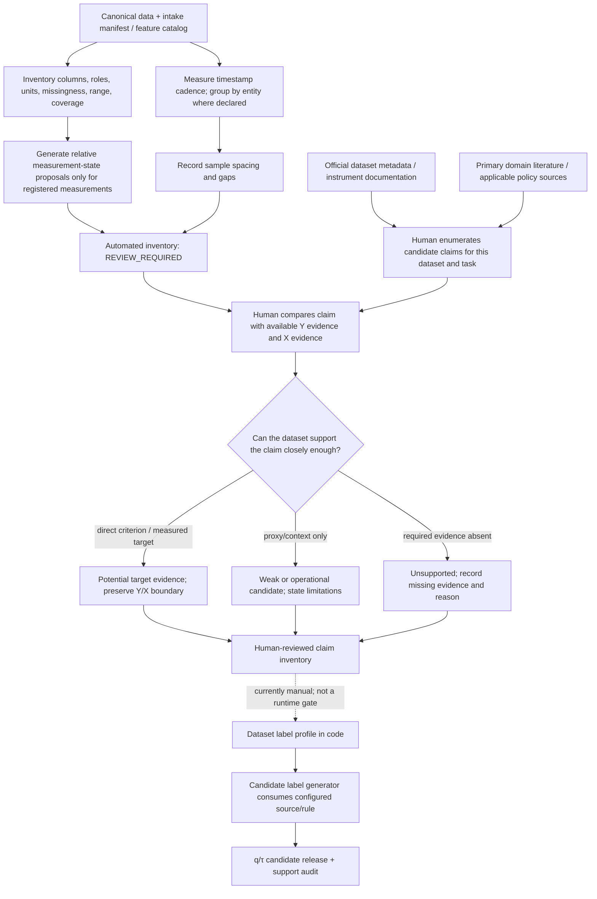

# Dataset-driven claim discovery and label governance

## Purpose

Discover what a dataset can support before deciding what a model should
distinguish. The domain is read from each dataset's contents and metadata; the
pipeline does not assume that every dataset is agricultural or force one shared
label ontology onto unrelated sources.

The output of discovery is a reviewable claim inventory, not a label release.
Every candidate claim records its evidence, proposed rule, source knowledge,
limitations, and the reason a claim is unsupported or still uncertain.

## Evidence classes

| Class | Meaning | Example |
|---|---|---|
| Direct observation | A field directly records the named quantity/state, within its stated instrument limits. It may be a target source under a reviewed target contract, but it must not leak into X. | UCI `criterion.co_gt_mg_m3`; Stuard ambient RH sensor reading. |
| Weak proxy candidate | Metadata or literature connects available observations to a separate claim, but does not certify each row's truth. | UCI CO-targeted sensor response as a candidate proxy for relative elevated CO. |
| Operational/context evidence | Records an intervention, regime, device, or environment that can define a separate task, but is not a physiological/environmental outcome. | Stuard irrigation line regime and water-meter volume. |
| Unsupported / insufficient | Required evidence, units, calibration, reference, or context is absent or contradicted. | “Safe air” from UCI sensor response alone; tomato plant stress from Stuard soil/air telemetry alone. |

These are evidence statuses, not mutually exclusive class labels. A weak proxy
candidate must never be described as independently observed ground truth. A
candidate excluded for insufficient evidence is not `REF`, negative, or a
model class. `REF` may only mean that all selected, sufficiently observed
candidate rules are known negative.

## Discovery and approval stages

1. **Dataset inventory:** read source manifests and canonical schema; inventory
   fields, units, sensor/criterion roles, entities, sampling cadence,
   missingness, ranges, and temporal coverage.
2. **Claim enumeration:** propose claims that fit the measured quantities and
   available context. Check authoritative dataset metadata, instrument
   documentation, and relevant primary domain sources. Store exact URLs and
   the narrow claim each source supports.
3. **Evidence assessment:** classify each proposal as direct observation,
   weak proxy candidate, operational/context evidence, or unsupported. State
   what is missing and why. Separate exploratory association analysis from
   evidence used to define a rule.
4. **Candidate-rule materialization:** only approved hypotheses may generate
   candidate labels. Preserve alternative thresholds/directions/horizons as
   candidate IDs; do not pick the best-looking rule using held-out criteria.
5. **Independent audit and semantic review:** test support, calibration, and
   transport; review criterion correspondence on a separate temporal cohort
   where available; then explicitly select zero, one, or multiple supported
   claims for a benchmark contract.
6. **Pre-train audit:** select features and the chosen target columns by stable
   sample ID. Criteria, target-derived values, and future-derived fields stay
   outside model features.

## Discovery diagram: automated facts versus human claim review



The key distinction is that the inventory CLI measures what is present; it
does not decide the meaning of a signal or retrieve/validate literature. The
human review records whether each claim is supported, weakly supported, or
unsupported and why. Today the label profile is still configured separately,
so a candidate label run can be produced without a machine-enforced approval
ID. The output is therefore a candidate artifact, not a reviewed target
release.

External knowledge is a cited hypothesis source, not a truth authority for
sample-level labels. Sample labels derived from thresholds/persistence remain
weak labels. A primary target is not frozen until its evidence, rule, support,
eligibility, and evaluation contract are reviewed.

## Initial claim inventory: UCI Air Quality

The source describes hourly metal-oxide sensor **responses**, nominally
associated with gases, and separate co-located reference-analyzer
concentrations. It also reports cross-sensitivity and sensor/concept drift.
The source is an urban road-level deployment, not an agricultural trial.

| Claim proposal | Available evidence | Initial disposition | Key limitation / next audit |
|---|---|---|---|
| High/low response state for each PT08 sensor | Direct hourly response values and source's nominal gas association. | Supported as a sensor-response claim; q-tail rule can create weak relative-state candidates. | Does not mean high/low pollutant concentration; per-sensor direction and drift matter. |
| Elevated CO concentration | `CO(GT)` is described by UCI as true hourly average CO concentration measured by a co-located certified reference analyzer; PT08.S1 is the corresponding nominal low-cost response. | Direct target evidence. Current implementation now fits q=5/10/15/20% relative upper-tail candidates from `CO(GT)` over the first 21 days; exclude the criterion from X. | These are dataset-relative concentration events, not WHO/regulatory exceedances. Missing criterion rows remain unknown. |
| Elevated NOx concentration | `NOx(GT)` is described as true hourly average concentration from the certified reference analyzer; PT08.S3 is a nominal sensor response. | Direct target evidence. Current implementation now fits q=5/10/15/20% relative upper-tail candidates from `NOx(GT)` over the first 21 days; exclude the criterion from X. | NOx is not interchangeable with NO2 regulatory standards. Do not infer target direction from PT08.S3; exploratory full-scope association is inverse (paired n=6,577, Spearman ρ≈−0.777), so the old upper-response NOx profile is superseded. |
| CO/NOx multi-label task and `REF` | Both independently measured criterion series are available; each defines one binary head under its own q candidate. | Implemented candidate path. Both heads may be positive. | `REF` means both selected criterion-derived events are known negative; it must not mean clean/safe air. If either criterion is missing, joint state is unknown. |
| Sensor-response-only CO/NOx proxy labels | PT08.S1 and PT08.S3 are nominally targeted; exploratory scoped data showed CO response correlation with CO criterion (paired n=6,536, Spearman ρ≈+0.891) and inverse NOx response association. | Superseded as the source of UCI pollutant labels. PT08 remains candidate X, not Y. | Full-scope associations are exploratory and do not change targets. Cross-sensitivity and drift remain. |
| Regulatory “safe/unsafe air”, health risk, AQI, PM2.5/PM10, or crop impact | No policy-specific threshold contract, health outcomes, particulate reference, crop metadata, or crop physiology in this source. | Unsupported by current source/evidence. | Would require jurisdiction/time averaging rules, missing reference measurements, health/exposure outcomes, or relevant crop observations. |

Source references: [UCI Air Quality dataset metadata](https://archive.ics.uci.edu/dataset/360/air%2Bquality) identifies PT08 sensor responses separately from true hourly concentrations measured by the co-located certified analyzer, and reports road-level deployment, drift, and cross-sensitivity. The UCI introductory paper is De Vito et al. (2008), linked from that source page.

## Initial claim inventory: Stuard tomato irrigation

The source identifies HEINZ 1301 tomato, three distinct irrigation regimes,
soil/air telemetry, water meters, and daily thermal indicators. It does not
provide independent plant-physiology stress labels or yield outcomes.

| Claim proposal | Available evidence | Initial disposition | Key limitation / next audit |
|---|---|---|---|
| Soil-sensor humidity/moisture relative state | Soil sensor values, timestamp, line/device identity. | Direct sensor observation; low/high q-tail states may be weak relative-state targets. | Do not rename a device's humidity output as calibrated volumetric soil water content or plant stress without sensor calibration/soil context. |
| Irrigation regime or measured water-delivery event | Line metadata (1.0/0.6/0.3 of Irriframe) and water-meter volume. | Operational/context claim with stronger direct evidence than plant outcome claims. | Keep action/regime separate from soil response; meter cumulative/delta semantics and timing need their own validation. |
| Ambient RH, temperature, CO2, pressure states | Environmental sensor channels with declared units/ranges. | Direct sensor-response/state claims; relative candidate labels can be constructed. | Threshold categories remain relative unless external agronomic or regulatory limits are sourced and applicable. |
| Tomato plant water stress, adequate water, yield, or disease | Crop identity and irrigation regime are known, but no independent plant physiology/yield/disease target is in this telemetry release. | Unsupported from this dataset alone. | Requires plant-level measurements/assessment, validated soil-water/plant relations, crop stage and suitable reference evidence. |

The [Stuard data article](https://doi.org/10.1016/j.dib.2025.111521) describes
the crop, regimes, sensors, and sampling. It supports dataset context and
measurement interpretation; it does not turn telemetry-derived stress rules
into ground truth.

## Initial claim inventory: in-house Firebase telemetry

Retain the current reviewed in-house label rules and semantic contract unless
their owners approve a change. Discovery should inventory the actual sensor,
firmware, calibration, validity, and metadata evidence for each rule before
proposing new tasks. Existing rules are not automatically portable to UCI,
Stuard, or other future sources.

## Implementation boundary and remaining work

- `Backend/Benchmark/claim_discovery` now scans canonical columns using roles
  from the intake run manifest, summarizes numeric evidence/cadence/missingness,
  and proposes relative observed-value states only. This does not mine the web
  or decide semantic claims.
- This file remains the human-reviewed, cited semantic inventory for the two
  external datasets; it is not a frozen label contract.
- The external label profile still is dataset-configured, but its UCI heads
  now read certified criterion columns as target sources and record PT08 as
  candidate inputs. The feature lane independently excludes criteria from X.
- Earlier UCI candidate runs based on sensor tails remain historical and must
  not be used. New criterion-based runs are still sensitivity candidates, not
  a frozen semantic release or evidence of absolute regulatory exceedance.
- A follow-up implementation should make label hypotheses dataset-bound and
  schema-validated, require reviewed claim IDs before materializing trainable
  targets, and preserve the criterion-only boundary. The current inventory
  command emits `REVIEW_REQUIRED`; label generation does not yet enforce that
  gate.

Generate the current evidence inventory before reviewing label semantics:

```powershell
python -m Backend.Benchmark.claim_discovery.main `
  --canonical <intake-run>/canonical.parquet `
  --intake-manifest <intake-run>/run_manifest.json `
  --output-root Backend/Output_data/wade_external_validation_pack/processed/claim_discovery
```

For the existing Firebase/Layer1 source, use the Layer1 feature catalog to
map measurement roles. Canonical CSV and source-specific timestamp/entity
columns are supported:

```powershell
python -m Backend.Benchmark.claim_discovery.main `
  --canonical Backend/Output_data/Layer1/canonical/telemetry_history.csv `
  --intake-manifest Backend/Output_data/Layer1/manifest.json `
  --feature-catalog Backend/Output_data/Layer1/canonical/feature_catalog.csv `
  --dataset-id firebase_layer1 `
  --timestamp-column record.sample_time_local `
  --entity-column record.node_id `
  --output-root Backend/Benchmark/claim_discovery/artifacts
```
