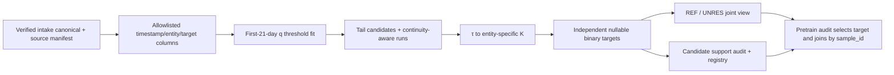

# External label candidate flow

## Responsibility boundary

## Implemented behavior

- The intake run manifest, canonical artifact, raw manifest, and checksums are
  verified before the label stage reads the canonical Parquet file.
- The reader requests only source-specific allowlisted target measurements,
  timestamps, and entity identifiers. UCI `(GT)` criteria, Stuard water-meter
  readings, and unrelated fields never enter the label engine.
- Thresholds use the first 21 days only. The q grid is 5/10/15/20% event-tail
  share. Stuard uses lower quantiles; each UCI head uses its own upper-tail
  threshold at quantile `1-q`.
- τ candidates are 30/45/60/90 minutes and map to `K=ceil(τ/median cadence)`
  for each source entity. Cadence gaps outside the in-house nominal 13–17
  minute interval normalized to the observed entity median break a tail run.
- A positive target needs a current tail value and a continuous run of at
  least K records. Current non-tail measurements receive 0; missing values and
  tail runs shorter than K receive null/UNRES. For UCI, both heads may be
  positive; `REF` requires both head labels to be known 0.
- Every q/τ pair is preserved as a candidate. There is no primary selection,
  evaluation split, or model fitting in this lane.
- Support is reported for all rows, the calibration interval, and the
  post-calibration interval, with per-entity cadence/K, event counts, and
  unknown reasons. This makes temporal support shifts visible before target
  selection.

## Handoff

The candidate labels table is a separate target authority. The pre-train audit
selects its named target columns and joins them to feature groups and a
separate split artifact using stable `sample_id`. The in-house weak-label
authority remains unchanged.
