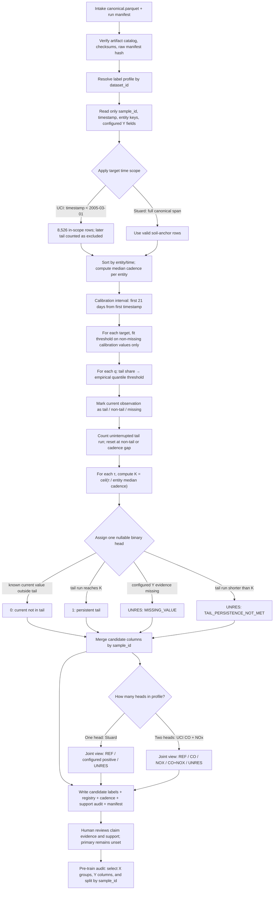
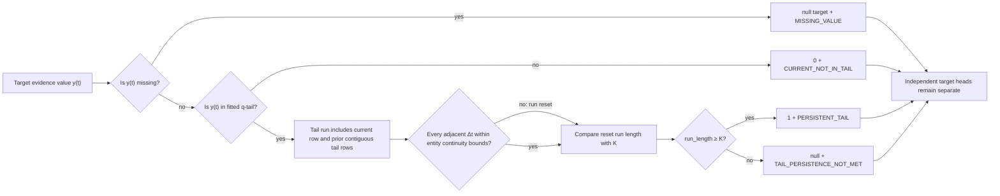

# External label candidate flow

## Responsibility boundary

The diagram shows the implemented path. The `claim_discovery` report is a
review input, but the current profile-driven CLI does **not** enforce approved
claim IDs. Therefore the output status remains `CANDIDATE_AUDIT_REVIEW_REQUIRED`
and the model runner must not be treated as automatically authorized by this
diagram.

## Label-rule detail: what changes each cell

| Current profile | Y evidence | Tail direction | q candidates | τ candidates | Cadence result |
|---|---|---|---|---|---|
| UCI CO head | `criterion.co_gt_mg_m3` (certified reference criterion) | Upper | 5%, 10%, 15%, 20% | 60, 120, 240 min | Exact hourly cadence gives K=1, 2, 4. |
| UCI NOx head | `criterion.nox_gt_ppb` (certified reference criterion) | Upper | 5%, 10%, 15%, 20% | 60, 120, 240 min | Exact hourly cadence gives K=1, 2, 4. |
| Stuard soil-moisture head | `soil_moisture_pct` sensor measurement | Lower | 5%, 10%, 15%, 20% | 1, 2, 6 days | K is computed separately from each line's observed median cadence. |

The q threshold and τ/K are two independent policy knobs: q decides which
measured values count as candidate tail values; τ decides how long a
contiguous tail must persist. A target marked `0` is a known non-tail value
under that candidate rule. It does not mean safe air, healthy crop, or a
negative finding about a claim that was never selected.

## Where to change a rule

| Desired change | Current owner | What changes in the output |
|---|---|---|
| Change dataset target source, meaning, direction, candidate positive name, or default τ | [profiles.py](profiles.py) | New registry/manifest semantics and a new candidate run. |
| Change default calibration days, q grid, or cadence-gap fractions | [contracts.py](contracts.py) and CLI overrides in [main.py](main.py) | Threshold fit, candidate support, and continuity decisions. |
| Change how a continuous run or missing observation maps to 0/1/unknown | [temporal.py](temporal.py) | Per-row target and status values. |
| Change independent-head combination and `REF`/joint classes | [candidates.py](candidates.py) | Joint state only; independent head columns remain available. |
| Change the claim evidence, what is unsupported, or why | [CLAIM_DISCOVERY.md](CLAIM_DISCOVERY.md) and the inventory logic under `claim_discovery/` | Review documentation/inventory; this does not currently block the label CLI. |
| Change X measurements or value/window groups | [external_features/profiles.py](../external_features/profiles.py) and the feature CLI options | Feature superset and registry; criterion-only fields remain rejected. |

Generated runs are immutable, timestamped artifacts. Edit a policy and rerun
to create a new version; compare `candidate_registry.csv`,
`candidate_support_audit.csv`, and `report.md` before promoting any rule.

## Implemented behavior

- `CLAIM_DISCOVERY.md` documents a dataset-driven evidence and claim-review
  framework and initial inventories for UCI and Stuard. It is currently a
  human-authored review artifact, not yet an executable discovery gate.
- Profiles remain dataset-specific. UCI targets now read certified
  `criterion.co_gt_mg_m3` and `criterion.nox_gt_ppb` as Y evidence; PT08.S1 and
  PT08.S3 are separately recorded as candidate X inputs. The earlier UCI
  sensor-tail label runs are historical and must not be used.
- A claim excluded for insufficient evidence is not assigned a negative or
  `REF` label. `REF` only describes known-negative states for all selected,
  reviewed heads; unknown evidence remains `UNRES`.

- The intake run manifest, canonical artifact, raw manifest, and checksums are
  verified before the label stage reads the canonical Parquet file.
- The reader requests only source-specific allowlisted target measurements,
  timestamps, and entity identifiers. UCI certified `CO(GT)`/`NOx(GT)` criteria
  are now the configured Y sources; PT08 responses remain candidate X fields
  and are not used to define those targets. Criteria are forbidden from X.
  Stuard water-meter readings remain operational evidence until an explicit
  event-claim rule is reviewed.
- UCI label candidates use timestamps before 2005-03-01, matching the
  documented March 2004–February 2005 dataset period. Later rows remain in
  immutable raw/canonical intake artifacts and are counted as scope exclusions
  in the candidate run manifest.
- Candidate runs fit thresholds on the first 21 days and retain configured q
  event-tail candidates. Stuard uses lower soil-sensor tails; UCI uses upper
  tails of certified measured CO/NOx concentration as Y. The UCI q labels mean
  relative high-concentration events, not standard exceedances. UCI criterion
  columns remain excluded from X.
- τ maps to `K=ceil(τ/median cadence)` for each source entity. Cadence gaps
  outside the in-house nominal 13–17
  minute interval normalized to the observed entity median break a tail run.
- For tomato, exploratory τ candidates of 1, 2, and 6 days were added from a
  field study that detected soil-water-stress onset indications at those lags
  across drying cycles. This is not a cultivar/site-specific cutoff. On the
  current Stuard data, the 6-day candidate has zero positives and is not
  train-estimable.
- UCI has exact 60-minute records, so τ=60/120/240 realize K=1/2/4. Urban
  studies analyze duration of sustained hourly CO/NO2 threshold events; this
  supports duration as an event attribute, not a universal cutoff. Horizons
  remain sensitivity candidates, with weaker transfer to total NOx. Its sensors
  were deployed at road level in an Italian city; crop biology does not define
  its claim horizons. Earlier UCI runs before the February-only scope must not
  be joined with the scoped feature run. Scoped candidate labels are also
  exploratory until their q/τ support and target semantics are reviewed.
- A positive target needs a current tail value and a continuous run of at
  least K records. Current non-tail measurements receive 0; missing values and
  tail runs shorter than K receive null/UNRES. For UCI, both heads may be
  positive; `REF` requires both head labels to be known 0.
- Every q/τ pair is preserved as a candidate. There is no primary selection,
  evaluation split, or model fitting in this lane.
- The current full UCI candidate run uses q=5/10/15/20% and τ=1/2/4 hours,
  on the 8,526-row pre-March scope. Its feature superset and labels align in
  `sample_id` order. These candidates have not passed semantic/support review.
- Support is reported for all rows, the calibration interval, and the
  post-calibration interval, with per-entity cadence/K, event counts, and
  unknown reasons. This makes temporal support shifts visible before target
  selection.

## Handoff

The candidate labels table is a separate target authority. The pre-train audit
selects its named target columns and joins them to feature groups and a
separate split artifact using stable `sample_id`. The in-house weak-label
authority remains unchanged.
