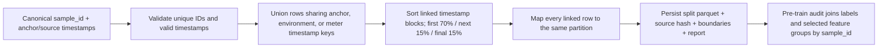

# External timestamp-block split flow

Current output is one forward chronological holdout, not repeated rolling
folds. No sample is shuffled and shared anchor/environment/meter timestamps
cannot cross partitions.
This lane does not establish target support or freeze an external task.
