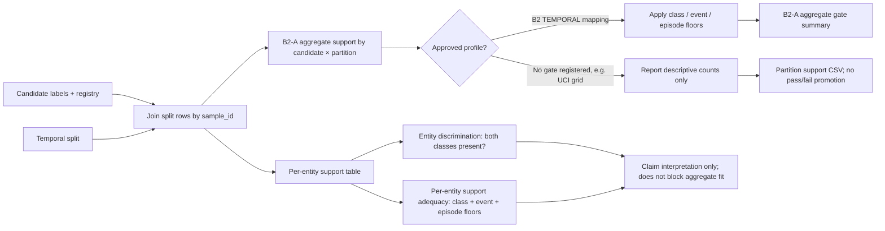

# External support audit flow

**B2-A** checks at least 20 rows per class, five persistent events, and five
distinct entity-specific episode clusters in each partition. The
`candidate_entity_support.csv` reports two independent properties per entity
and partition: mathematical discrimination estimability (both classes are
present) and support adequacy (at least 20 rows per class, five persistent
events, and five distinct positive episode clusters). The
`candidate_entity_estimability.csv` summary reports counts and statuses for
both. A line may therefore be mathematically estimable while still lacking
enough evidence for a within-line claim. Neither status blocks an aggregate
diagnostic fit. The v1 `entity_claim_estimability_status` field remains as a
compatibility alias for mathematical two-class estimability; consumers should
use `entity_support_adequacy_status` when interpreting evidence sufficiency.
Single-series datasets report both entity layers as not applicable when no
entity dimension exists.

`grid_main` uses the same keyed support summary shape for candidates without a
registered gate. It reports q/τ class counts, unknowns, prevalence, and event
counts per partition, while recording `support_gate_applied=false`. In
particular, the UCI sensitivity grid must not inherit Stuard's B2 thresholds.

Neither path selects a target from model scores or trains a model. The output
is an auditable support input for the pre-train audit and target review.
