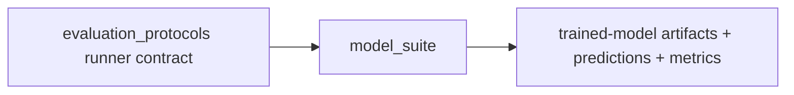

# Model Suite Flow

## Layer Contract

## Input

- one `evaluation_protocols` run directory
- selected training profile
- selected model keys
- model registry and artifact policy config

## This Layer Does

- read the locked protocol manifests
- train the requested models on the allowed train rows
- apply reduced hyperparameters only to profiles whose name starts with
  `smoke_`; named non-smoke profiles use the registered model catalog defaults
- evaluate them on the allowed evaluation rows
- write prediction and metric artifacts under the tranche-0 contract
- run artifact-consistency and independent-oracle positive controls; a job
  is not valid when either control disagrees
- preserve supported-class metrics separately from fixed-ontology metrics and
  record `fixed_ontology_estimability_status` in job and pooled reports

It does **not** define benchmark folds or weak labels.

## Output

- per-job model artifacts
  - `<model_key>.joblib`
  - `model_bundle.joblib`
  - `model_manifest.json`
  - `preprocessing_metadata.json`
  - `training_console.log`
- per-job tranche-0 evaluation artifacts
  - `metrics.json`
  - `predictions.parquet`
  - `per_class_metrics.csv`
  - `slice_metrics.csv`
  - `confusion_matrix.csv`
  - `feature_effects.csv`
  - `run_validation.json`
  - `run_metadata.json`
  - `rule_control_summary.json`
  - `artifact_consistency_disagreements.parquet`
  - `independent_oracle_disagreements.parquet`
  - `disagreement_samples.parquet`
- profile/run summary artifacts
  - `training_summary.csv`
  - `training_validation.csv`
  - `per_sample_predictions.csv`
  - `pooled_metrics.csv`
  - `model_comparison_table.csv`
  - `run_report.md`
  - `ARTIFACT_GUIDE.md`
  - `profiles/README.md` or `smoke_protocol/README.md`
  - `profiles/<profile>/README.md`
  - `profiles/<profile>/jobs/README.md`
  - `run_manifest.json`
  - `artifact_catalog.csv`

## Main Handoff

- downstream prediction and metric authority for `validity_lifecycle`
- downstream positive-control evidence for tranche-0 synthesis and
  ambiguity review
