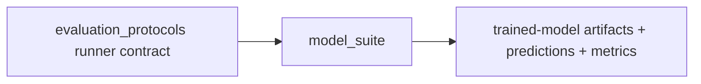

# Model Suite Flow

## Layer Contract



## Post-hoc prediction analyses

`analysis/` contains non-mutating analyses over already materialized model
predictions. The UNRES-origin join reads the existing
`temporal_k_gated_3h` `per_sample_predictions.csv` and the audit-only
`UNRES_K`/`UNRES_A` artifact, joins on `sample_id` (anchor), and writes a new
sibling directory under `artifacts/`. It does not load model weights, run
inference, retrain, change labels, or change the three-class target ontology.

The resulting folder is named:

```text
artifacts/temporal_unres_origin_prediction_join_<run_id>/
```

It contains row-level joined predictions, the origin-by-`LOW`/`UNRES`/`REF`
summary, join coverage, source hashes, and a Markdown report.

The paired event/online analysis is a separate sibling lane.  The profile
`temporal_event_online_3h` trains one job per temporal feature view and target
view, writes `target_view_id` into job/prediction/pooled artifacts, and runs a
target-aware independent oracle.  The post-hoc comparison module evaluates the
G cohort where `Y_event=LOW` but `Y_online=UNRES`, including aligned metrics,
cross-aligned diagnostics, prediction transitions, and a chart.  This lane
requires new training because the target assignment changed; it does not
replace the primary temporal benchmark.

The online run-depth focal analysis is another non-mutating sibling lane. It
keeps `Y_online`, selects Q-positive point observations, bins current support
depth into `d=1`, `d=2`, and `d>=3`, and separates successful (`L_r>=K`) from
failed (`L_r<K`) runs. It reuses an existing online prediction file and
reports both the hard LOW-prediction fraction and mean predicted LOW
probability. It does not load weights, run inference, retrain, or change
labels.

The provenance-strata analysis is a further non-mutating sibling lane. It
keeps the three model outputs `LOW/UNRES/REF`, then adds five audit strata:
`LOW`, `U_K_succ`, `U_K_fail`, `U_A`, and `REF`. It builds the online 5x3
prediction map, the K-specific `d=1/d=2/d>=3` decomposition, and a paired
event-versus-online probability/transition comparison on the same anchors.
`L_r` and the event label are used only after prediction for provenance and
retrospective comparison; they are never model features. It does not load
weights, run inference, retrain, or mutate labels.

The configured R/K matrix is an additive training lane under
`analysis/k_window_variants/configured_main.py`. It materializes four explicit
feature contracts: R00 snapshot, R10 window summaries, R01 ordered causal
flatten, and R11 window plus ordered flatten. It runs the approved schedule of
K1 R00/R11 and K3 online/event R00/R10/R01/R11, while preserving separate
target semantics and post-hoc U_K provenance strata. It does not mutate native
labels or upstream feature artifacts.

The robustness claim-audit lane is an additive training lane under
`analysis/k_window_variants/robustness_main.py`. It isolates
`R_pure_lag=[X_t,L_t]` from the 17 lag-age/history-quality metadata fields,
runs same-dimensional row-wise lag-order disruption controls, reports
`UNRES_K`/`UNRES_A` conditional test metrics, runs the protocol-owned 5-day
temporal folds, and evaluates a direct M-history threshold oracle. The oracle
and provenance strata are controls/analyses only; they are not promoted
features or labels.

Its output folder is:

```text
artifacts/online_run_depth_focal_<run_id>/
```

The robustness output folder is:

```text
artifacts/k_robustness_audit_<run_id>/
```

The ordered representation lane is an additive training lane under
`analysis/k_window_variants/ordered_main.py`. It runs the explicit sequence
`Oracle -> M_t -> X_t -> M-history -> X-history -> X-history+context` for
the separate K3 online and K3 event targets. The trainable contracts are
current moisture (1), current nine-sensor snapshot (9), moisture plus 12
causal lags (13), nine sensors plus 108 causal lags (117), and sensor history
plus 45 causal context summaries (162). Acquisition/history-quality metadata
is kept out of the final step. The new Firebase candidate is not silently
mixed into this lane without a matching approved label release.

The corrected RQ1 lane is an additive training lane under
`analysis/k_window_variants/rq1_main.py`. It supersedes the preceding ordered
sequence as the primary incremental-information analysis because its main
chain is genuinely nested: `S0=M_t -> S1=X_t -> S2=X_t+H_M ->
S3=X_t+H_X -> S4=X_t+H_X+C`. `B_M=M_t+H_M` is a diagnostic branch. The lane
uses protocol-owned temporal folds, holds K3 online/event semantics separate,
and computes paired held-out log-loss/Brier contrasts with temporal block
bootstrap intervals. It writes analysis-only artifacts and does not mutate
canonical data, labels, or upstream feature views.

## Input

- one `evaluation_protocols` run directory
- selected training profile
- selected model keys
- model registry and artifact policy config

## This Layer Does

- read the locked protocol manifests
- train the requested models on the allowed train rows
- apply reduced hyperparameters only to profiles whose name starts with
  `smoke_`; named non-smoke profiles use the registered model catalog defaults
- evaluate them on the allowed evaluation rows
- write prediction and metric artifacts under the tranche-0 contract
- run artifact-consistency and independent-oracle positive controls; a job
  is not valid when either control disagrees
- preserve supported-class metrics separately from fixed-ontology metrics and
  record `fixed_ontology_estimability_status` in job and pooled reports
- for the run-depth focal lane, join Q-positive lineage to existing online
  predictions and calculate depth/outcome strata
- for the provenance-strata lane, join the paired existing online/event
  predictions to five lineage strata and calculate hard/probability maps,
  K-state contrasts, and event-minus-online deltas
- for the robustness lane, train controlled feature contracts, preserve
  fold/support status, report mean/std temporal metrics, and evaluate the
  deterministic threshold-history positive control

It does **not** define benchmark folds or weak labels.

## Output

- per-job model artifacts
  - `<model_key>.joblib`
  - `model_bundle.joblib`
  - `model_manifest.json`
  - `preprocessing_metadata.json`
  - `training_console.log`
- per-job tranche-0 evaluation artifacts
  - `metrics.json`
  - `predictions.parquet`
  - `per_class_metrics.csv`
  - `slice_metrics.csv`
  - `confusion_matrix.csv`
  - `feature_effects.csv`
  - `run_validation.json`
  - `run_metadata.json`
  - `rule_control_summary.json`
  - `artifact_consistency_disagreements.parquet`
  - `independent_oracle_disagreements.parquet`
  - `disagreement_samples.parquet`
- profile/run summary artifacts
  - `training_summary.csv`
  - `training_validation.csv`
  - `per_sample_predictions.csv`
  - `pooled_metrics.csv`
  - `model_comparison_table.csv`
  - `run_report.md`
  - `ARTIFACT_GUIDE.md`
  - `profiles/README.md` or `smoke_protocol/README.md`
  - `profiles/<profile>/README.md`
  - `profiles/<profile>/jobs/README.md`
  - `run_manifest.json`
  - `artifact_catalog.csv`

The run-depth focal lane additionally emits:

- `q_positive_run_depth_population.parquet`
- `online_run_depth_prediction_rows.parquet`
- `q_positive_run_depth_population_summary.csv`
- `online_run_depth_prediction_summary.csv`
- `online_low_prediction_rate.png`
- `online_run_depth_focal_report.md`

The provenance-strata lane additionally emits a sibling folder named
`artifacts/provenance_strata_analysis_<run_id>/` containing:

- `provenance_assignments.parquet`
- `online_prediction_rows.parquet`, `event_prediction_rows.parquet`, and
  `paired_event_online_prediction_rows.parquet`
- online/event 5x3 confusion counts, row rates, and output probabilities
- `k_specific_decomposition.csv` and `k_specific_contrasts.csv`
- `event_online_probability_deltas.csv` and
  `event_online_prediction_transitions.csv`
- three PNG figures and `provenance_strata_report.md`

## Main Handoff

- downstream prediction and metric authority for `validity_lifecycle`
- downstream positive-control evidence for tranche-0 synthesis and
  ambiguity review
