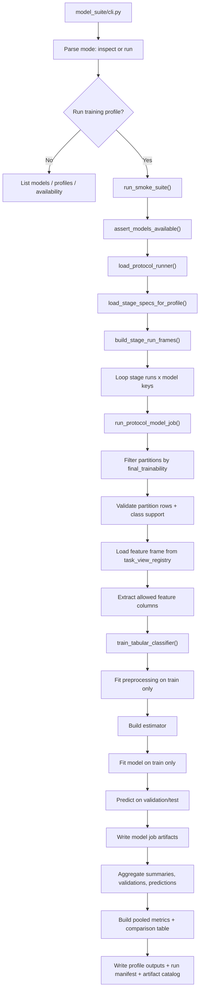

# Model Suite Flow

## Purpose

`model_suite` consumes a locked runner contract and executes training
and evaluation for each model job. It does not construct benchmark
folds or weak labels upstream.

## Entrypoint

- CLI:
  - `python Backend/Benchmark/model_suite/cli.py ...`
- Runtime:
  - `cli.py -> run_smoke_suite()`
  - `pipeline/orchestration.py`
  - `pipeline/native_runner.py`
  - `pipeline/training_job.py`

## Implemented flow

## What comes in

- one `evaluation_protocols` run directory
- training profile name
- selected model keys
- model registry config
- artifact policy config

## What goes out

- per-job:
  - `<model_key>.joblib`
  - `model_bundle.joblib`
  - `model_manifest.json`
  - `preprocessing_metadata.json`
  - `metrics.json`
  - `training_console.log`
- per-profile:
  - `training_summary.csv`
  - `training_validation.csv`
  - `per_sample_predictions.csv`
  - `pooled_metrics.csv`
  - `model_comparison_table.csv`
  - `run_report.md`
- per-run:
  - `run_manifest.json`
  - `artifact_catalog.csv`

## Folder map

- `cli.py`
  - entrypoint for inspection and execution
- `pipeline/orchestration.py`
  - run-level loop across stage/model jobs
- `pipeline/native_runner.py`
  - one job for one feature-view/fold/scope combination
- `pipeline/training_job.py`
  - preprocessing, estimator fit/predict, and persistence
- `data/`
  - protocol runner loading and stage-frame resolution
- `registries/`
  - model profiles and estimator builders
- `evaluation/`
  - metrics, pooling, comparisons
- `persistence/`
  - bundle, manifest, and artifact catalog

## Important guarantees

- train and evaluation partitions come from the runner contract rather
  than local inference
- preprocessing is fit on `train` only
- the model is fit on `train` only
- evaluation predictions are produced only for the partitions requested
  by the stage

## Read this next

1. `cli.py`
2. `pipeline/orchestration.py`
3. `data/protocol_loader.py`
4. `data/scope_resolver.py`
5. `pipeline/native_runner.py`
6. `pipeline/training_job.py`
7. `evaluation/metrics.py`
