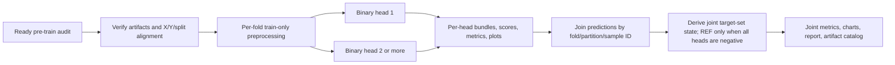

# Independent multi-label model flow

The runner consumes only a pre-train audit with `ready_for_model_policy_review`
status, checks its persisted artifact hashes, and fits one existing binary
estimator for each selected target. Shared preprocessing is fit using the
training rows only. Every target must have complete labels and both classes in
each training fold. Evaluation metrics use rows with known truth for that
target; predictions and probabilities are still written for all requested
evaluation rows. Joint truth is unknown if any component target is unknown.

`REF` is a derived display state for all-negative predictions. It is not a
third estimator or a target label written back into the binary label artifact.
This lane does not choose weak-label Q/τ rules, folds, or feature groups.
