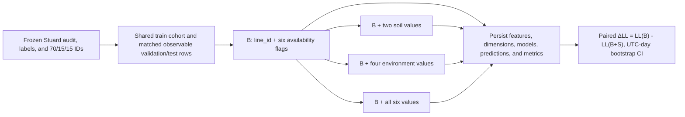

# Independent multi-label model flow

```mermaid
flowchart LR
    A["Ready pre-train audit"] --> B["Verify artifacts and X/Y/split alignment"]
    B --> C{"Training mask policy"}
    C -->|"complete case"| C1["Shared known-label cohort"]
    C -->|"per_head_known"| C2["Target-specific known-label cohorts"]
    C1 --> O{"Require observable X?"}
    C2 --> O
    O -->|"Yes"| O1["Target-known AND at least one selected X observed"]
    O -->|"No"| O2["Target-known; legacy imputation policy"]
    O1 --> D["Fit preprocessing and binary estimator per head"]
    O2 --> D
    D --> E["Per-head bundles, scores, metrics, plots"]
    E --> A["No-X evaluation rows retained as MODEL_ABSTAIN_NO_X"]
    E --> F["Join predictions by fold/partition/sample ID"]
    F --> G["Derive REF/positive-target state; joint abstain if any head has no X"]
    G --> H["Known-truth AND observable-X metrics + UTC-day bootstrap"]
    H --> H2["Per-entity discrimination vs proper-loss estimability"]
    H --> I["Combined metrics, charts, report, artifact catalog"]
```

The runner consumes only a pre-train audit with `ready_for_model_policy_review`
status, checks its persisted artifact hashes, and fits one existing binary
estimator for each selected target, including a single-target dataset.
Preprocessing is fit using only the corresponding training cohort. Under
`complete_case`, all selected targets share a cohort. Under `per_head_known`,
each target excludes only its own unknown training labels. Each head must have
both classes in its known-label cohort. The optional
`require_observable_features` policy adds a distinct X mask: at least one
selected feature must be finite and observed. No-X rows remain in the
prediction artifact with `x_observable=false`, null prediction/probability,
and `prediction_status=MODEL_ABSTAIN_NO_X`; they are not imputed into the
primary fit or evaluation cohort. Metrics and temporal bootstrap use rows with
known truth AND observable X, while total, known/unknown, observable, and
abstention counts remain separately reported. The default is false for
compatibility; external primary runs should enable it. Joint truth is unknown
if any component target is unknown, and joint prediction abstains if any head
has no observable X.

`REF` is a derived display state for all-negative predictions. It is not a
third estimator or a target label written back into the binary label artifact.
This lane does not choose weak-label Q/τ rules, folds, or feature groups.
Single-class entity partitions still have calculable Brier and log-loss when
known predictions exist; discrimination measures are marked not estimable.
Use `--no-use-balanced-sample-weight` for external runs whose primary
probabilistic metrics are raw log-loss and Brier risk.

## Stuard acquisition-attribution control

The four arms share the same availability indicators, line identity, training
IDs, validation/test IDs, XGBoost profile, seed, unweighted fit, and
training-only median imputation. Only observed-value groups differ. This
control partitions aggregate predictive gain by value group; it does not
establish within-line discrimination where per-line test support is inadequate
or validate the weak target against an independent criterion.
