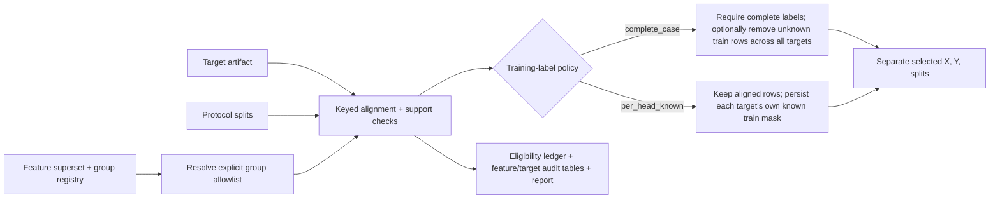

# Pre-train Audit Flow

## Responsibilities

- verify the feature matrix checksum, schema, ordered columns, and group hashes
- verify ordered feature, row, and sample identity hashes when registered
- reject target, criterion, split, audit, and identifier columns as model features
- reject source columns defining a target and their registered descendants
- preserve the explicit Stuard sensor-only versus optional
  sensor-plus-irrigation-context contrast; line ID remains provenance only
- require all protocol sample IDs to resolve in both the feature and target artifacts
- reject cross-partition sample reuse within a fold; by default, block missing
  training labels
- support a shared complete-case cohort or target-specific `per_head_known`
  cohorts; retain evaluation unknowns and write target-specific mask columns
  in the eligibility ledger
- do not convert unknown labels to negative; model heads determine their own
  training rows from the declared audit policy and fit preprocessing per head
- report per-fold/partition support, missing targets, per-feature missingness,
  all-missing features, and constant features
- retain a keyed, separate X/Y/split handoff for review

It does not define targets or folds, fit estimators, choose decision thresholds,
or replace the established `evaluation_protocols` and `model_suite` runners.
