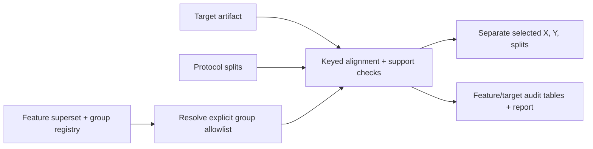

# Pre-train Audit Flow

## Responsibilities

- verify the feature matrix checksum, schema, ordered columns, and group hashes
- verify ordered feature, row, and sample identity hashes when registered
- reject target, criterion, split, audit, and identifier columns as model features
- require all protocol sample IDs to resolve in both the feature and target artifacts
- reject cross-partition sample reuse within a fold and missing training labels
- report per-fold/partition support, missing targets, per-feature missingness,
  all-missing features, and constant features
- retain a keyed, separate X/Y/split handoff for review

It does not define targets or folds, fit estimators, choose decision thresholds,
or replace the established `evaluation_protocols` and `model_suite` runners.
