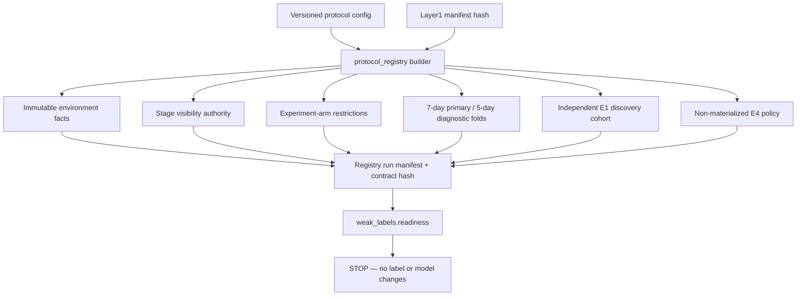

# Protocol Registry Flow


```mermaid
flowchart TD
    A["Versioned protocol config"] --> C["protocol_registry builder"]
    B["Layer1 manifest hash"] --> C
    C --> D["Immutable environment facts"]
    C --> E["Stage visibility authority"]
    C --> F["Experiment-arm restrictions"]
    C --> G["7-day primary / 5-day diagnostic folds"]
    C --> H["Independent E1 discovery cohort"]
    C --> I["Non-materialized E4 policy"]
    D --> J["Registry run manifest + contract hash"]
    E --> J
    F --> J
    G --> J
    H --> J
    I --> J
    J --> K["weak_labels.readiness"]
    K --> L["STOP — no label or model changes"]
```

Dependency direction is one-way:

```text
Layer1 → protocol_registry → weak_labels.readiness
```

The registry has no dependency on later Benchmark lanes.
