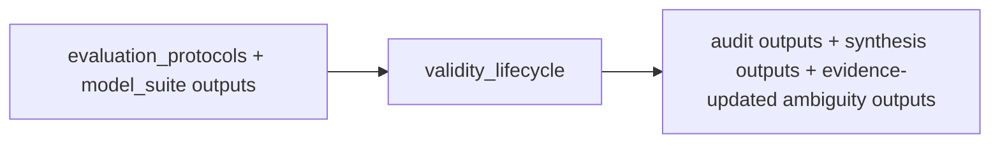

# Validity Lifecycle Flow

## Layer Contract

## Input

- one `evaluation_protocols` run
- linked `dataset_views` and `weak_labels` runs referenced by that
  protocol run
- one linked `model_suite` run
- preregistered claim, comparison, and experiment registries

## This Layer Does

- audit whether the benchmark sample universe is actually supportable
  across E1, E2, and E3
- consume model predictions and pooled metrics under the registered
  claim/comparison contract
- write tranche-0 synthesis artifacts and evidence-updated ambiguity
  artifacts

It does **not** create new splits or train new models.

## Output

- audit outputs
  - `manifests/observation_registry.*`
  - `manifests/view_observation_registry.*`
  - `audits/environment_support_matrix.csv`
  - `audits/environment_eligibility_matrix.csv`
  - `audits/environment_continuity_matrix.csv`
  - `audits/comparison_hash_audit.csv`
  - `audits/ec_npk_dependency.csv`
  - `audits/ph_measurement_stability.csv`
- synthesis outputs
  - `synthesis/dependency_effects.parquet`
  - `synthesis/dependency_stability_matrix.csv`
  - `synthesis/dependency_classification.csv`
  - `synthesis/estimability_matrix.csv`
  - `synthesis/effect_uncertainty.csv`
  - `synthesis/claim_evidence_matrix.csv`
  - `synthesis/source_expansion_operational_effects.csv`
  - `synthesis/source_expansion_matched_budget_effects.csv`
- ambiguity outputs
  - `ambiguity/candidate_ambiguity_sets.yaml`
  - `ambiguity/evidence_updated_ambiguity_sets.yaml`
  - `ambiguity/failure_attribution_matrix.csv`
  - `ambiguity/non_identifiability_report.md`
- run/report outputs
  - `run_metadata/validity_lifecycle_validation.json`
  - `run_metadata/run_manifest.json`
  - `run_metadata/artifact_catalog.csv`
  - `reports/validity_lifecycle_audit_report.md`

## Main Handoff

- human-readable and machine-readable tranche-0 review surface for the
  benchmark
- final layer in the current artifact chain:
  `protocol -> model -> synthesis -> evidence-updated ambiguity`
