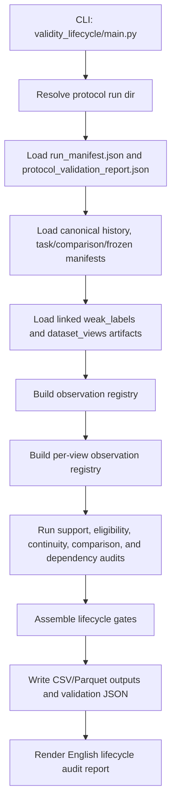
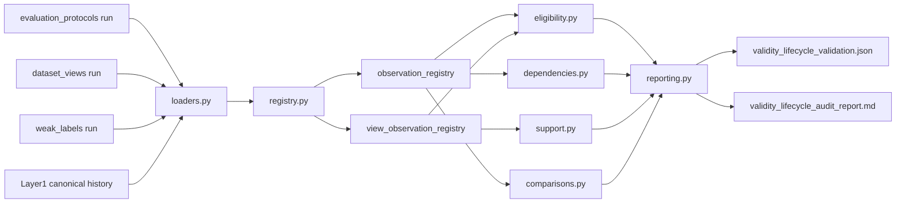
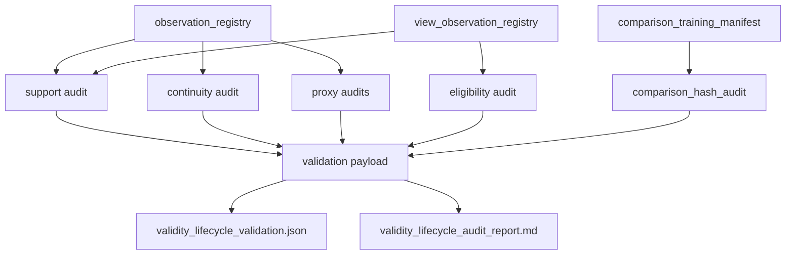

# Validity Lifecycle Flow

`validity_lifecycle` is a contract-following audit lane. It does not
create new benchmark assignments; it reads the existing benchmark
contract and explains whether the current data are strong enough to
support later lifecycle experiments.

## Entry Point

- `python Backend/Benchmark/validity_lifecycle/main.py ...`

## Build Order

## Internal Block Diagram

## Output Ownership By Block

- `loaders.py`
  - no persisted outputs
  - resolves linked artifact inputs and converts them into in-memory
    frames
- `registry.py`
  - `manifests/observation_registry.parquet`
  - `manifests/observation_registry.csv`
  - `manifests/view_observation_registry.parquet`
  - `manifests/view_observation_registry.csv`
- `support.py`
  - `audits/environment_support_matrix.csv`
  - `audits/label_first_occurrence.csv`
  - `audits/class_day_segment_support.csv`
- `eligibility.py`
  - `audits/environment_eligibility_matrix.csv`
  - `audits/environment_continuity_matrix.csv`
- `comparisons.py`
  - `audits/comparison_hash_audit.csv`
- `dependencies.py`
  - `audits/ec_npk_dependency.csv`
  - `audits/ph_measurement_stability.csv`
- `reporting.py`
  - `run_metadata/validity_lifecycle_validation.json`
  - `reports/validity_lifecycle_audit_report.md`
  - `run_metadata/run_manifest.json`
  - `run_metadata/artifact_catalog.csv`

## What To Edit When A Specific Output Looks Wrong

- If `environment_support_matrix.csv` is wrong:
  - start in `registry.py` for environment assignment and target
    mapping
  - then inspect `audits/support.py`
- If `environment_eligibility_matrix.csv` is wrong:
  - inspect `registry.py` window-eligibility columns first
  - then inspect `audits/eligibility.py`
- If `comparison_hash_audit.csv` is wrong:
  - inspect `evaluation_protocols` matched cohort construction first
  - then inspect `audits/comparisons.py`
- If `ec_npk_dependency.csv` or `ph_measurement_stability.csv` is wrong:
  - inspect `registry.py` source measurement columns first
  - then inspect `audits/dependencies.py`
- If the final status in `validity_lifecycle_validation.json` is wrong:
  - inspect `reporting.py`
  - then inspect whichever upstream audit file fed the wrong gate

## Lifecycle Output Map

## Core Questions

The report answers five stage questions:

1. What evidence is usable in Discovery?
2. Is Temporal falsification support actually present?
3. Does Source expansion add transport evidence or only more source
   rows?
4. What survives Deployment transport?
5. Which failures remain ambiguous and therefore require collection
   repair?
