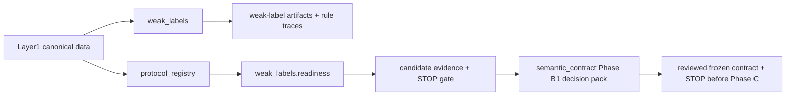

# Weak Labels Flow

## Layer Contract



`weak_labels` and `weak_labels.readiness` are separate execution paths.
Readiness never calls the label builder and its candidate outputs are not
label authority.

## Input

- Layer1 canonical history
- Layer1 feature catalog
- Layer1/segment manifest context
- weak-label configuration such as threshold mode, base split mode,
  and exploratory persistence threshold `k`

## This Layer Does

- generate the weak-label targets for point and V2 tasks
- keep the current primary public scope centered on point labels and
  `v2-3h`, while still allowing explicit `8h` outputs
- keep intrinsic eligibility and exclusion separate from downstream
  protocol decisions
- publish condition-level rule traces and threshold provenance for
  tranche-0 auditability
- emit explicit support counts for persistent-low threshold sweeps so
  nearby `k` values can be inspected before downstream training
- separate semantic fired rules, gate outcomes, resolution IDs, and
  label-transfer provenance inside the tranche-0 audit contract

It does **not** decide benchmark fold IDs, deployment environments, or
final trainability.

## Phase A Readiness Path

- consumes an explicit `protocol_registry` run;
- reads full evidence only for E1;
- emits structural commitments only for sealed E2/E3;
- separates deployment, strict, window, and causal evaluation continuity;
- reconstructs Q diagnostics on `E1_DISCOVERY_TRAIN_V1`;
- reports candidate ontology resolution and legacy inconsistencies;
- stops at `STOP_NO_BENCHMARK_LABEL_CHANGES`.

## Phase B Semantic Contract Path

Phase B is a separate lane under `weak_labels/semantic_contract`.

- reads only a PASS Phase A run, its parent protocol registry, and E1
  canonical evidence;
- separates observed auxiliary evidence from `point_context_incomplete`;
- emits an exhaustive reachability-aware compatibility matrix;
- scans Q05/Q10/Q15/Q20 across all data-supported K values;
- classifies primary, local, breakpoint, moderate, strong, and extreme K
  regimes without model scores;
- stops at `PRIMARY_K_REVIEW_REQUIRED` until a reviewed decision artifact is
  supplied;
- after review, writes a frozen semantic contract and an additive
  `CONTRACT_FROZEN` registry;
- records a canonical freeze snapshot commitment for future-target governance;
- keeps E2/E3 sealed and downstream runners locked until the native engine and
  later release gates are complete.

Phase B does not call the label builder, materialize labels, modify canonical
data, train models, or publish dataset views.

## Phase C Native Engine Path

The Phase C native lane is contract-gated and additive. It requires a reviewed
Phase B2 frozen contract containing the operationalization, derived-evidence,
compatibility, continuity, and complete window registries. It authorizes E1
payloads before loading evidence and rejects E2/E3 sensitive rows at the input
boundary.

The native order is:

```text
canonical validation
  → deployment/strict adjacency
  → derived evidence
  → RuleFiring
  → point Resolution/Assignment
  → observed runs
  → window eligibility
  → temporal Resolution/Assignment
  → Same-Y transfer projection
  → semantic fold projection
  → differential audit
  → atomic publication
```

Native artifacts are task-oriented (`point`, `same_y`, `temporal_anchor`) and
are materialized only from first-class assignments. Same-Y is a source-label
transfer projection. Feature-view admissibility and train-ready cohorts remain
Phase D responsibilities. Legacy weak-label runs are regression references,
not scientific oracles. Phase C ends at `NATIVE_ENGINE_IMPLEMENTED` with
`downstream_runners_unlocked=false`.

## Output

- point label artifacts
  - `point/point_evidence_flags.parquet`
  - `point/point_labels_detailed.parquet`
  - `point/point_labels_train.parquet`
- V2 label artifacts
  - `v2/v2_same_y_labels.parquet`
  - `v2/v2_temporal_labels_3h.parquet`
  - `v2/v2_temporal_labels_8h.parquet`
- tranche-0 audit artifacts
  - `audit/label_assignment.parquet`
    - authoritative assignment provenance with `fired_rule_ids`,
      `primary_fired_rule_id`, `resolution_id`, `assignment_mode`, and
      transfer lineage fields
  - `audit/rule_firings.parquet`
    - condition-level rule and gate evaluation only; same-Y transfer is
      not represented as a synthetic environmental firing
  - `audit/rule_registry.csv`
  - `audit/threshold_registry.csv`
  - `audit/label_source_dependency.csv`
- run-level scope aids
  - `run_metadata/current_scope_summary.json`
  - `ARTIFACT_GUIDE.md`
- threshold-support aids
  - `threshold_diagnostics/persistent_low_k_support.csv`
- supporting audits and registries

## Main Handoff

- downstream label authority for `evaluation_protocols`
- downstream rule-trace authority for exact-rule validation and later
  synthesis
