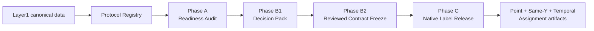

# Weak Labels Flow

Sơ đồ chi tiết theo từng phase nằm tại
[`architecture/README.md`](architecture/README.md). File này chỉ giữ lifecycle
tổng quát; các phase không được đọc như một function call graph.

## W1 package boundaries

The authority path is organized by lifecycle and responsibility:

```text
contracts
  → lifecycle/phase_a_readiness
  → lifecycle/phase_b_contract
  → semantic evidence/continuity/point/temporal
  → lifecycle/phase_c_native
  → provenance and task artifacts
```

`compatibility/differential/` contains only comparison tooling for immutable
historical outputs. Former runtime, point, V2, and partition source modules
are removed from the executable package.

## Layer Contract



The Phase C assignment release is consumed by Evaluation through an explicit
environment execution profile. For the current RQ1 run this is E1-only:
Evaluation joins the native assignments with dataset views, applies fold and
purge projection, and emits the train-candidate manifest. E2/E3 are separate
future profiles and are not implicitly joined.

## Lifecycle reports and diagrams

The phase folders contain the human-readable report and two data-flow views:

| Lifecycle unit | Report | Overview | Detail |
|---|---|---|---|
| Phase A Readiness | [`phase_a_readiness/REPORT.md`](lifecycle/phase_a_readiness/REPORT.md) | [`flow_overview.mmd`](lifecycle/phase_a_readiness/flow_overview.mmd) | [`flow_detail.mmd`](lifecycle/phase_a_readiness/flow_detail.mmd) |
| Phase B Contract | [`phase_b_contract/REPORT.md`](lifecycle/phase_b_contract/REPORT.md) | [`flow_overview.mmd`](lifecycle/phase_b_contract/flow_overview.mmd) | [`flow_detail.mmd`](lifecycle/phase_b_contract/flow_detail.mmd) |
| Phase C Native | [`phase_c_native/REPORT.md`](lifecycle/phase_c_native/REPORT.md) | [`flow_overview.mmd`](lifecycle/phase_c_native/flow_overview.mmd) | [`flow_detail.mmd`](lifecycle/phase_c_native/flow_detail.mmd) |

The diagrams describe data entering a meaningful processing block, the rules
and parameters applied there, and the artifact leaving it. They are not a
function call graph.

Readiness never calls the label engine and its candidate outputs are not label
authority. There is one executable label path: the native lifecycle.

## Input

- Layer1 canonical history
- Layer1/segment manifest context
- frozen Phase B semantic contract and protocol authorization

## This Layer Does

- generate native Point, Same-Y transfer, and Temporal targets
- keep public task identity in the native release manifest, independent of
  historical `V2` directory naming
- keep intrinsic eligibility and exclusion separate from downstream
  protocol decisions
- publish condition-level rule traces and threshold provenance for
  tranche-0 auditability
- emit explicit RuleFiring, Resolution, continuity, and Assignment provenance
- separate semantic fired rules, gate outcomes, resolution IDs, and
  label-transfer provenance inside the tranche-0 audit contract

It does **not** decide benchmark fold IDs, deployment environments, or
final trainability.

### Field-level applicability

Rule and derived-evidence consumers use the validity of the measurement they
actually inspect. Moisture rules resolve `npk.soil_moisture_valid`, EC rules
resolve `npk.ec_valid`, and temporal deltas require both the current and
strictly previous field to be valid. The aggregate `npk.valid` remains a
compatibility/fault indicator; it cannot hide an independently valid N/P/K,
EC, temperature, or moisture value when another field (for example pH) is
invalid. Source, calibration regime, protocol/value validity, and error class
remain audit evidence and are not added to label classes or feature arms.

## Phase A Readiness Path

- consumes an explicit `protocol_registry` run;
- reads full evidence only for E1;
- emits structural commitments only for sealed E2/E3;
- separates deployment, strict, window, and causal evaluation continuity;
- reconstructs Q diagnostics on `E1_DISCOVERY_TRAIN_V1`;
- reports candidate ontology resolution; legacy inconsistencies are an
  optional differential branch and never a Phase A prerequisite;
- stops at `STOP_NO_BENCHMARK_LABEL_CHANGES`.

## Phase B Semantic Contract Path

Phase B is a separate lane under `weak_labels/lifecycle/phase_b_contract`.

- reads only a PASS Phase A run, its parent protocol registry, and E1
  canonical evidence;
- separates observed auxiliary evidence from `point_context_incomplete`;
- emits an exhaustive reachability-aware compatibility matrix;
- scans Q05/Q10/Q15/Q20 across all data-supported K values;
- classifies primary, local, breakpoint, moderate, strong, and extreme K
  regimes without model scores;
- stops at `PRIMARY_SELECTION_REVIEW_REQUIRED` until a reviewed decision artifact is
  supplied;
- after review, writes a frozen semantic contract and an additive
  `CONTRACT_FROZEN` registry;
- records a canonical freeze snapshot commitment for future-target governance;
- keeps E2/E3 sealed and downstream runners locked until the native engine and
  later release gates are complete.

Phase B does not call the label builder, materialize labels, modify canonical
data, train models, or publish dataset views.

### B1 admissibility rule

B1 publishes two separate audit notions for every Q×K×fold×split:

- `semantic_assignment_admissible`: the anchor's persistence-label dependency
  and deployment membership are valid. B2 uses this for semantic support and
  contract safety.
- `feature_history_admissible`: the feature history stays inside the nominal
  split. This is diagnostic for evaluation and does not change the intrinsic
  weak label.

Therefore a feature-only boundary crossing is reported but is not a B2
semantic failure. A persistence/deployment crossing remains blocking. Fixed
fold boundaries are not moved by B1 or B2; the boundary experiment is
non-authoritative and only reports what a shift would cost.

## Phase C Native Engine Path

The Phase C native lane is contract-gated and authoritative. It requires a reviewed
Phase B2 frozen contract containing the operationalization, derived-evidence,
compatibility, continuity, and complete window registries. It authorizes E1
payloads before loading evidence and rejects E2/E3 sensitive rows at the input
boundary.

The native order is:

```text
canonical validation
  → deployment/strict adjacency
  → derived evidence
  → RuleFiring
  → point Resolution/Assignment
  → observed runs
  → window eligibility
  → temporal Resolution/Assignment
  → Same-Y transfer projection
  → semantic fold projection
  → differential audit
  → atomic publication
```

Native artifacts are task-oriented (`point`, `same_y`, `temporal`) and are
materialized only from first-class assignments. Same-Y is a source-label
transfer projection. Feature-view admissibility and train-ready cohorts remain
evaluation responsibilities. Historical weak-label runs are regression
fixtures, not runtime inputs. Phase C ends with a native label-release
manifest and `NATIVE_ENGINE_IMPLEMENTED` while downstream runners remain
locked.

## Output

- native label release
  - `tasks/point/assignments.parquet`
  - `tasks/same_y/horizon_3h/assignments.parquet`
  - `tasks/same_y/horizon_8h/assignments.parquet`
  - `tasks/temporal/horizon_3h/assignments.parquet`
  - `tasks/temporal/horizon_8h/assignments.parquet`
  - `run_metadata/label_release_manifest.json`
- tranche-0 audit artifacts
  - `audit/assignments.parquet`
    - authoritative Assignment provenance with resolution and transfer fields
  - `audit/rule_firings.parquet`
    - condition-level rule and gate evaluation only; same-Y transfer is
      not represented as a synthetic environmental firing
  - `audit/rule_registry.csv`
  - `audit/threshold_registry.csv`
  - `audit/label_source_dependency.csv`
- run-level metadata
  - `run_metadata/native_engine_validation.yaml`
  - `run_metadata/artifact_catalog.csv`

## Derived UNRES-origin analysis

The published temporal label remains the authority. An audit-only sibling
artifact may derive `UNRES_K` and `UNRES_A` from the native temporal
assignment plus point/rule/continuity evidence:

```text
artifacts/phase_c/temporal_unres_origin_split_<run_id>/
```

`UNRES_K` means `M_t <= Q` with strict support depth `d_t < K`; `UNRES_A`
means `M_t > Q` with at least one positive auxiliary rule. The derived field
is for later fallback experiments and row filtering. It does not mutate the
native label release, create a new training ontology, or run model evaluation.

## Main Handoff

- downstream label authority for `evaluation_protocols`
- downstream rule-trace authority for exact-rule validation and later
  synthesis

## Additive event/online target views

The native temporal release remains the label authority.  The analysis module
`analysis/temporal_target_views.py` materializes an additive sibling containing
two target views over the same native rows:

- `temporal_online_3h`: causal label using support depth `d_t` at the anchor;
- `temporal_event_3h`: retrospective label using completed run length `L_r`.

Both retain the three model-facing classes `LOW/UNRES/REF` (with the native
long names) and provenance columns for `run_id`, `d_t`, `L_r`, `unres_origin`,
and `event_vs_online_changed`.  Right-censored LOW runs are
`EVENT_UNDETERMINED` abstentions and are excluded from the paired cohort.
Future data is used only to define `Y_event`, never as a feature.  The output
is a sibling under
`artifacts/phase_c/temporal_event_online_target_views_<run_id>/`; it does not
mutate the native release or feature artifacts.
