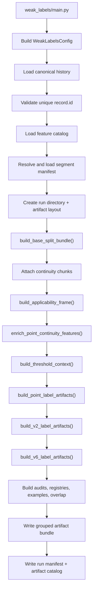

# Weak Labels Flow

## Purpose

`weak_labels` is the label-authority lane. It builds point, V2, and V6
label artifacts from canonical Layer1, but it does not own downstream
benchmark fold authority.

## Entrypoint

- CLI:
  - `python Backend/Benchmark/weak_labels/main.py ...`
- Runtime:
  - `main.py -> build_weak_labels()`
  - `runtime/pipeline.py`

## Implemented flow

## What comes in

- Layer1 canonical history
- Layer1 feature catalog
- Layer1 manifest or segment manifest
- weak-label config:
  - base split strategy
  - run profile
  - threshold mode

## What goes out

- `point/point_evidence_flags.parquet`
- `point/point_labels_detailed.parquet`
- `point/point_labels_train.parquet`
- `v2/v2_same_y_labels.parquet`
- `v2/v2_temporal_labels_3h.parquet`
- `v2/v2_temporal_labels_8h.parquet`
- `v6/v6_event_labels.parquet`
- `v6/v6_b8_block_labels.parquet`
- audits, threshold diagnostics, registries, and artifact catalog

## Folder map

- `runtime/pipeline.py`
  - main orchestration
- `point/`
  - applicability, thresholds, point evidence, point train labels
- `v2/`
  - same-Y and temporal-window label logic
- `v6/`
  - event and block label logic
- `partitions/`
  - base split context for intrinsic rule fitting
- `reporting/`
  - distributions, overlaps, examples, run manifest
- `io/`
  - load and write helpers

## Important boundary

- `partitions/` here does not mean final fold authority for benchmark
  training
- `weak_labels` owns:
  - intrinsic eligibility
  - intrinsic exclusion
  - weak label state
- `evaluation_protocols` owns:
  - fold ids
  - deployment domains
  - final trainability

## Read this next

1. `main.py`
2. `runtime/pipeline.py`
3. `partitions/splitting.py`
4. `point/artifacts.py`
5. `v2/artifacts.py`
6. `v6/artifacts.py`
7. `reporting/audits.py`
