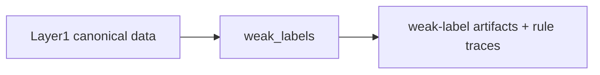

# Weak Labels Flow

## Layer Contract

## Input

- Layer1 canonical history
- Layer1 feature catalog
- Layer1/segment manifest context
- weak-label configuration such as threshold mode and base split mode

## This Layer Does

- generate the weak-label targets for point, V2, and optional V6 tasks
- keep the current primary public scope centered on point labels and
  `v2-3h`, while still allowing explicit `8h` and `v6` outputs
- keep intrinsic eligibility and exclusion separate from downstream
  protocol decisions
- publish condition-level rule traces and threshold provenance for
  tranche-0 auditability
- separate semantic fired rules, gate outcomes, resolution IDs, and
  label-transfer provenance inside the tranche-0 audit contract

It does **not** decide benchmark fold IDs, deployment environments, or
final trainability.

## Output

- point label artifacts
  - `point/point_evidence_flags.parquet`
  - `point/point_labels_detailed.parquet`
  - `point/point_labels_train.parquet`
- primary V2 label artifacts
  - `v2/v2_same_y_labels.parquet`
  - `v2/v2_temporal_labels_3h.parquet`
- optional explicit V2 label artifacts
  - `v2/v2_temporal_labels_8h.parquet`
- optional explicit V6 label artifacts
  - `v6/v6_event_labels.parquet`
  - `v6/v6_b8_block_labels.parquet`
- tranche-0 audit artifacts
  - `audit/label_assignment.parquet`
    - authoritative assignment provenance with `fired_rule_ids`,
      `primary_fired_rule_id`, `resolution_id`, `assignment_mode`, and
      transfer lineage fields
  - `audit/rule_firings.parquet`
    - condition-level rule and gate evaluation only; same-Y transfer is
      not represented as a synthetic environmental firing
  - `audit/rule_registry.csv`
  - `audit/threshold_registry.csv`
  - `audit/label_source_dependency.csv`
- run-level scope aids
  - `run_metadata/current_scope_summary.json`
  - `ARTIFACT_GUIDE.md`
- supporting audits and registries

## Main Handoff

- downstream label authority for `evaluation_protocols`
- downstream rule-trace authority for exact-rule validation and later
  synthesis
