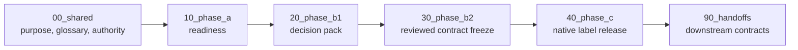

# Weak Labels — Architecture Map

## Mục đích

Folder này mô tả **Weak Label làm gì**, theo lifecycle từ dữ liệu Layer1 đến
label authority. Đây là tài liệu kiến trúc, không phải runtime package và
không tạo thêm một execution pipeline.

## Đọc theo thứ tự



Mỗi phase có `README.md`, `core_flow.mmd`, `support_flow.mmd`,
`inputs_outputs.md`, và `artifact_map.md`.

Bản đồ semantic-label hợp nhất của Phase C được sinh từ frozen contract và
native release bằng:

```powershell
python Backend\Benchmark\weak_labels\architecture\tools\generate_semantic_label_draft.py `
  --contract-dir D:\AgriFusion-IoT\Backend\Benchmark\weak_labels\artifacts\phase_b\semantic_contract_20260805_043324 `
  --release-dir D:\AgriFusion-IoT\Backend\Benchmark\weak_labels\artifacts\phase_c\native_engine_20260805_045419_359073 `
  --output-dir D:\AgriFusion-IoT\Backend\Benchmark\weak_labels\artifacts\semantic_label_maps\<run_id>
```

Tool này chỉ đọc contract/release và tạo report/`.mmd`; nó không chạy lại
resolver và không thay đổi label authority.

## Trạng thái

```yaml
architecture_status: DOCUMENTED
runtime_changed: true
label_authority_changed: false
```

- `IMPLEMENTED`: đã có code và output quan sát được.
- `PARTIAL`: có code nhưng còn thiếu kiểm chứng hoặc output.
- `PLANNED`: thuộc thiết kế đích.
- `BLOCKED`: chưa thể đi tiếp vì thiếu tiền điều kiện.
