# Phase C — Native Semantic Label Release

## Vai trò trong lifecycle

Phase C là bước đầu tiên được phép tạo **label authority**. Nó không tự chọn
Q, K, resolver hoặc window semantics; tất cả phải đến từ frozen Phase B
contract.

```mermaid
flowchart LR
    A["Frozen Phase B contract"] --> B["C0 Contract preflight"]
    R["Frozen Protocol Registry"] --> B
    D["Layer1 canonical + E1 allowlist"] --> C["C1 Authorized input loading"]
    B --> C
    C --> E["C2 Continuity primitives"]
    E --> F["C3 Derived evidence"]
    F --> G["C4 RuleFiring"]
    G --> H["C5 Point Resolution + Assignment"]
    H --> I["C6 Runs + window eligibility"]
    I --> J["C7 Temporal Assignment"]
    H --> K["C7 Same-Y transfer"]
    J --> L["C8 Intrinsic artifacts + fold projection"]
    K --> L
    L --> M["C9 Referential integrity + replay"]
    M --> N["C10 Differential audit"]
    N --> O["C11 Atomic publication"]
    O --> P["Native label release\nNATIVE_ENGINE_IMPLEMENTED"]
```



## Dữ liệu vào và preflight

| Input | Vai trò |
|---|---|
| Frozen semantic contract | Authority cho Q/K, formulas, matrix, resolver, windows, IDs |
| Frozen Protocol Registry | Authority cho stage và E1 authorization |
| Canonical history | Sensor payload và canonical identity |
| Canonical evidence schema | Allowlist/kiểu dữ liệu payload |
| Sensor dependency registry | Dependency của sensor/derived evidence |
| Segment manifest | Deployment/segment boundary |
| Expected-difference contract | Predicate đã ký trước cho legacy differential audit |

Nếu thiếu bất kỳ contract/input nào, Phase C phải **fail closed**.

## Các khối xử lý

### C1 — Authorized input loading

1. Đọc structural membership từ registry.
2. Xác nhận `authorized_environment_ids = [E1]`.
3. Tạo allowlist `record.id`.
4. Chỉ sau đó mới đọc sensitive sensor payload E1.
5. Từ chối E2/E3 sensitive rows tại boundary.

### C2 — Continuity primitives

Tạo:

```text
deployment_segment_id
strict_continuity_id
previous_record_id
strictly_consecutive_from_previous
feature_dependency_interval
persistence_dependency_interval
```

Strict previous observation chỉ hợp lệ theo contract; elapsed duration không
được trở thành gate ẩn.

### C3 — Derived evidence

| Evidence | Công thức contract |
|---|---|
| VPD | Frozen Magnus transform, temperature/RH policy |
| Moisture rise | `current_moisture - strict_previous_moisture` |
| EC shift | `abs(current_ec - strict_previous_ec)` |

Missing, invalid, cadence break hoặc boundary violation tạo
`NOT_EVALUABLE`, không tạo negative.

### C4 — RuleFiring

Các rule đọc threshold exact từ contract:

```text
LOW_RELATIVE_MOISTURE: moisture <= LOW threshold
THERMAL_CONTEXT: VPD >= thermal threshold
MOISTURE_RISE: delta >= rise threshold
EC_SHIFT: abs delta >= EC threshold
```

Mỗi firing lưu applicability, evidence state, value, comparator, threshold và
dependency interval.

### C5 — Point resolution

```text
low NOT_EVALUABLE → POINT_NOT_EVALUABLE
low POSITIVE       → LOW
low NEGATIVE + auxiliary POSITIVE → UNRESOLVED_ENVIRONMENTAL
low NEGATIVE + auxiliary NOT_EVALUABLE → POINT_CONTEXT_INCOMPLETE
low NEGATIVE + auxiliary NEGATIVE → REFERENCE
```

`LOW` giữ lại transition/diagnostic tags; Same-Y không tạo ontology mới.

### C6–C7 — Temporal và Same-Y

- Observed low runs và support depth chỉ dùng history đến anchor.
- Window 3h/8h chỉ quyết định history eligibility.
- Temporal assignment truy ngược về point assignment và window evidence.
- Same-Y copy source point label; horizon không thay đổi `Y`.

### C8–C11 — Integrity và publication

Assignments intrinsic không phụ thuộc fold/split/purge. Fold projection chỉ
thêm evaluation admissibility. Sau đó engine kiểm tra lineage, deterministic
replay, expected-difference contract và ghi artifacts vào staging cùng
filesystem trước atomic rename.

## Artifacts authority

```text
tasks/point/assignments.parquet
tasks/same_y/horizon_3h/assignments.parquet
tasks/same_y/horizon_8h/assignments.parquet
tasks/temporal/horizon_3h/assignments.parquet
tasks/temporal/horizon_8h/assignments.parquet
```

Provenance:

```text
audit/rule_firings.parquet
audit/resolutions.parquet
audit/assignments.parquet
run_metadata/label_release_manifest.json
run_metadata/artifact_catalog.csv
```

## Trạng thái hiện tại

Phase C đã được chạy thành công và đã publish native release:

```text
native_engine_20260805_045419_359073
operationalization: Q10-K3
semantic_contract: SEMANTIC_CONTRACT_36280129f4ec1d40
point rows: 3291
```

Release này là label authority được `evaluation_protocols` tiêu thụ. Các
artifact `RuleFiring`, `Resolution`, `Assignment`, continuity và lineage đã
được ghi trong release; Fold/split/purge và train-ready eligibility vẫn thuộc
Evaluation. Nội dung sơ đồ chi tiết được tái sinh bởi semantic-label draft
generator trong `weak_labels/architecture/tools`.

## Quy tắc không được nhầm

```text
Phase A candidate evidence ≠ label authority
Phase B1 decision pack ≠ frozen contract
Phase C Assignment ≠ model-ready cohort
Feature eligibility và train readiness thuộc evaluation_protocols
```
