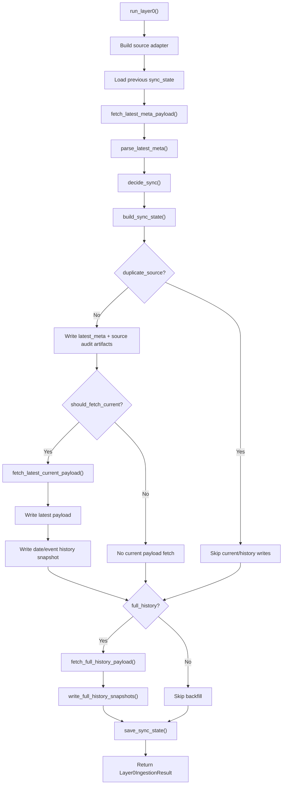

# Layer0 Flow

## Purpose

`layer0` is the raw-ingestion lane: it reads data from the configured
source, decides whether the payload should be fetched and persisted, and
writes immutable evidence into `Output_data/Layer0`.

## Entrypoint

- CLI:
  - `python Backend/main.py --only-layer0 ...`
- Runtime:
  - `Backend/main.py -> run_layer0()`
  - `Backend/Navigation/Core/layer0/pipeline.py -> Layer0IngestionPipeline.run()`

## Implemented flow

## What comes in

- CLI arguments from `Backend/main.py`
- `Backend/.env` and runtime settings
- source adapter:
  - Firebase RTDB
  - or JSON export
- previous sync state:
  - `Layer0/Firebase_data/new_raw/sync_state.json`

## What goes out

- `new_raw/latest_meta.json`
- `new_raw/latest.json`
- `new_raw/source_manifest.json`
- `new_raw/source_snapshot.json`
- `new_raw/sync_state.json`
- `history/<date>/<event>.json`
- full-history snapshots when `--full-history` is enabled

## Folder map

- `pipeline.py`
  - main orchestration
- `sources/`
  - adapter-specific fetch/load logic
- `sync/`
  - parse latest meta, decide sync, build next sync state
- `stores/`
  - write latest/raw/history/sync-state artifacts
- `models/`
  - source-domain data structures
- `utils/`
  - layout and low-level helpers

## Key logic boundaries

- `sources/` may know source APIs and file formats
- `sync/` may decide duplicate/new/retry behavior
- `stores/` may persist artifacts
- `pipeline.py` should orchestrate rather than accumulate large source
  or persistence rules

## Read this next

1. `pipeline.py`
2. `sources/firebase.py` or `sources/json_export.py`
3. `sync/latest_sync.py`
4. `stores/artifact_store.py`
5. `stores/telemetry_store.py`
6. `stores/sync_state_store.py`
