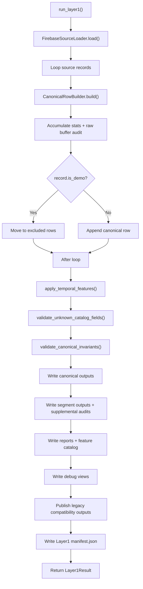

# Layer1 Flow

## Purpose

`layer1` transforms raw Layer0 telemetry into canonical history so that
benchmark lanes consume one stable source of truth.

## Entrypoint

- CLI:
  - `python Backend/main.py --only-layer1`
- Runtime:
  - `Backend/main.py -> run_layer1()`
  - `Backend/Navigation/Core/layer1/pipelines/preprocessing.py -> PreprocessingPipeline.run()`

## Implemented flow

## What comes in

- Layer0 raw artifacts
- optional in-memory source loader when Layer0 and Layer1 run back to
  back
- temporal settings
- export flags and validation policy

## What goes out

- `canonical/telemetry_history.parquet|csv`
- `canonical/telemetry_latest.json`
- `canonical/feature_catalog.csv`
- `segments/segments_manifest.json`
- `views/*.csv`
- `quality_reports/*.csv|json`
- `excluded/excluded_records.csv`
- legacy compatibility outputs in `sht30/`, `npk/`, `meteo/`

## Folder map

- `pipelines/`
  - orchestration
- `loaders/`
  - load source records from Layer0
- `processors/`
  - packet parsing, context extraction, canonical row assembly,
    temporal and segment features; network diagnostics are normalized into
    `network.*` raw audit context
- `validation/`
  - invariant checks
- `writers/`
  - canonical persistence, debug outputs, supplemental artifacts
- `reports/`
  - feature catalog and QA reports
- `publishers/`
  - compatibility outputs for older consumers
- `contracts/`
  - result types, field catalog, temporal settings

## Logic boundaries

- processors should not write to the filesystem
- writers should not compute domain features
- reports should only read canonical rows
- legacy publishers must remain downstream of canonical rows instead of
  becoming a second processing pipeline
- local PDP IP, IP validity/source, raw CSQ, and operator validity are
  retained as `RAW_ONLY` audit metadata; public/NAT IP is not part of the
  production canonical path
- sensor provenance and semantic validity are also canonical audit fields.
  They describe whether each numeric measurement is independently usable,
  where it came from, and (for moisture) which calibration regime applies;
  they are not added to feature arms automatically
- invalid-but-recorded observations remain traceable: SHT30 decoded values
  such as `-45/0` and pH raw zero can remain present as evidence while their
  field/value validity is false and their error class is available

## Read this next

1. `pipelines/preprocessing.py`
2. `loaders/firebase_loader.py`
3. `processors/canonical_row.py`
4. `processors/temporal.py`
5. `writers/canonical.py`
6. `writers/supplemental.py`
7. `reports/processing.py`
