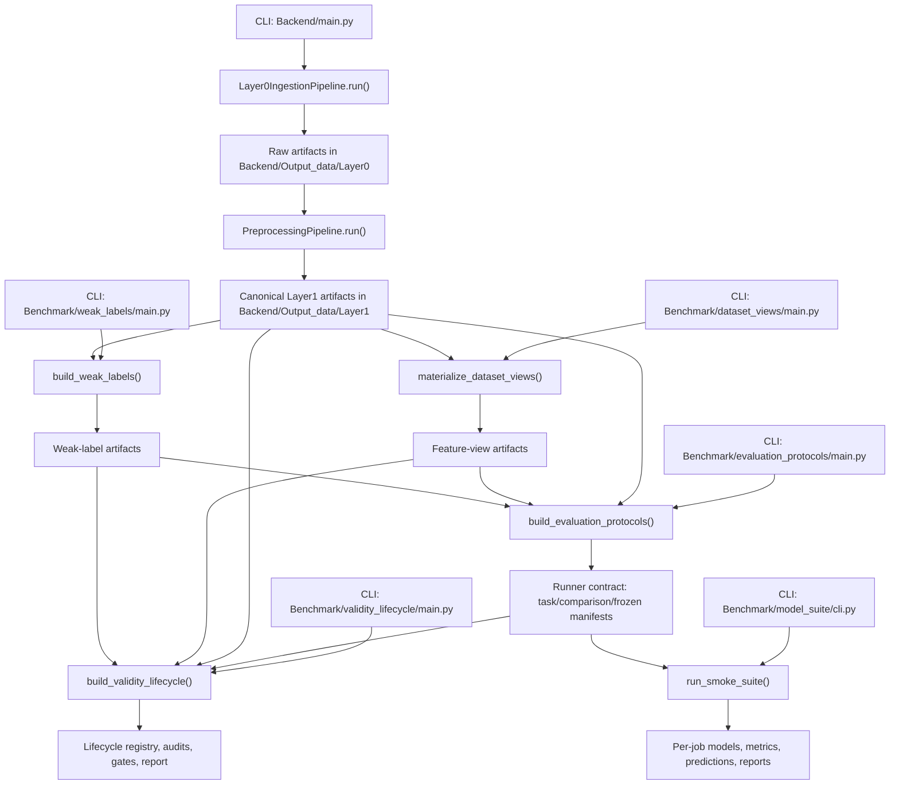
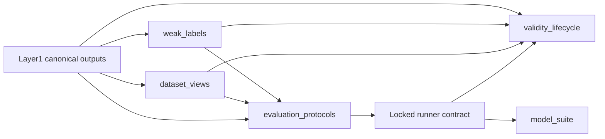
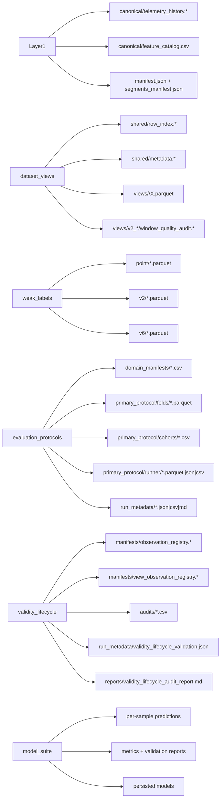

# Backend Pipeline Flow

## Purpose

This document describes the implemented end-to-end flow from ingestion
to training results in the current repository, and identifies which
folders are entrypoints, which folders define handoff contracts, and
which folders own the core logic.

## Naming note

- Older high-level docs often refer to the processing lane as `Core`.
- In the current workspace, that code lives under
  `Backend/Navigation/Core/`.
- When reading the implementation, follow the actual directory tree in
  the workspace.

## End-to-end flow

## What each stage owns

- `Backend/main.py`
  - orchestrates Layer0 and Layer1 only
  - does not run benchmark lanes
- `Backend/Navigation/Core/layer0`
  - fetches or loads raw telemetry
  - decides sync behavior
  - persists immutable evidence
- `Backend/Navigation/Core/layer1`
  - builds canonical telemetry history
  - attaches continuity and temporal fields
  - writes reports and compatibility outputs
- `Backend/Benchmark/dataset_views`
  - builds feature matrices from canonical Layer1
- `Backend/Benchmark/weak_labels`
  - builds label authority from canonical Layer1
- `Backend/Benchmark/evaluation_protocols`
  - freezes benchmark framing into a runner contract
- `Backend/Benchmark/validity_lifecycle`
  - re-audits the locked benchmark sample universe as lifecycle
    evidence for `E1`, `E2`, and `E3`
  - does not create new train/validation/test splits
- `Backend/Benchmark/model_suite`
  - trains and evaluates models from the locked runner contract

## Benchmark Block Diagram

This is the current connection order:

- `dataset_views` owns feature materialization.
- `weak_labels` owns label authority.
- `evaluation_protocols` owns benchmark framing and runner-facing
  manifests.
- `validity_lifecycle` owns pre-training readiness and ambiguity audits
  on top of that frozen contract.
- `model_suite` owns actual model fitting and held-out evaluation.

## Handoff files that matter

- Layer0 -> Layer1
  - `Backend/Output_data/Layer0/Firebase_data/history/**`
  - `Backend/Output_data/Layer0/Firebase_data/new_raw/**`
- Layer1 -> benchmark lanes
  - `Backend/Output_data/Layer1/canonical/telemetry_history.csv|parquet`
  - `Backend/Output_data/Layer1/canonical/feature_catalog.csv`
  - `Backend/Output_data/Layer1/manifest.json`
  - `Backend/Output_data/Layer1/segments/segments_manifest.json`
- `dataset_views` -> `evaluation_protocols`
  - `artifacts/<run_id>/shared/row_index.*`
  - `artifacts/<run_id>/views/<view_id>/X.parquet`
  - `artifacts/<run_id>/views/<view_id>/feature_columns.json`
- `weak_labels` -> `evaluation_protocols`
  - `point/point_labels_train.parquet`
  - `v2/v2_same_y_labels.parquet`
  - `v2/v2_temporal_labels_*.parquet`
  - `v6/*.parquet`
- `evaluation_protocols` -> `model_suite`
  - `primary_protocol/runner/task_view_registry.csv`
  - `primary_protocol/runner/task_training_manifest.parquet`
  - `primary_protocol/runner/comparison_training_manifest.parquet`
  - `primary_protocol/runner/frozen_target_manifest.parquet`
  - `primary_protocol/runner/runner_contract.json`
- `evaluation_protocols` -> `validity_lifecycle`
  - `run_metadata/run_manifest.json`
  - `run_metadata/protocol_validation_report.json`
  - `domain_manifests/deployment_domains.csv`
  - `primary_protocol/runner/task_view_registry.csv`
  - `primary_protocol/runner/task_training_manifest.parquet`
  - `primary_protocol/runner/comparison_training_manifest.parquet`
  - `primary_protocol/runner/frozen_target_manifest.parquet`
- `dataset_views` -> `validity_lifecycle`
  - `shared/metadata.parquet`
  - `shared/row_index.parquet`
  - `views/v1_sensor_row/X.parquet`
  - `views/v2_* / window_quality_audit.parquet`
- `weak_labels` -> `validity_lifecycle`
  - `point/point_labels_train.parquet`
  - `point/point_labels_detailed.parquet`
  - `point/point_evidence_flags.parquet`
  - `v2/v2_same_y_labels.parquet`
  - `v2/v2_temporal_evidence_*.parquet`
  - `v2/v2_temporal_labels_*.parquet`

## Stage Output Map

## Read order for a new maintainer

1. `Backend/main.py`
2. `Backend/Navigation/Core/layer0/FLOW.md`
3. `Backend/Navigation/Core/layer1/FLOW.md`
4. `Backend/Benchmark/dataset_views/FLOW.md`
5. `Backend/Benchmark/weak_labels/FLOW.md`
6. `Backend/Benchmark/evaluation_protocols/FLOW.md`
7. `Backend/Benchmark/validity_lifecycle/FLOW.md`
8. `Backend/Benchmark/model_suite/FLOW.md`
9. `Backend/Benchmark/BENCHMARK_TO_MODEL_SUITE_SPEC.md`

## Practical documentation convention

- `README.md`
  - boundary, scope, and artifact summary
- `FLOW.md`
  - implemented control flow
  - entrypoint
  - input/output
  - module map
  - Mermaid sequence or data-flow
  - "read this next" guide

This convention fits the repository well because the system is clearly
split into lanes, while each lane still contains enough internal modules
and artifact contracts to require a more implementation-oriented
companion document.
