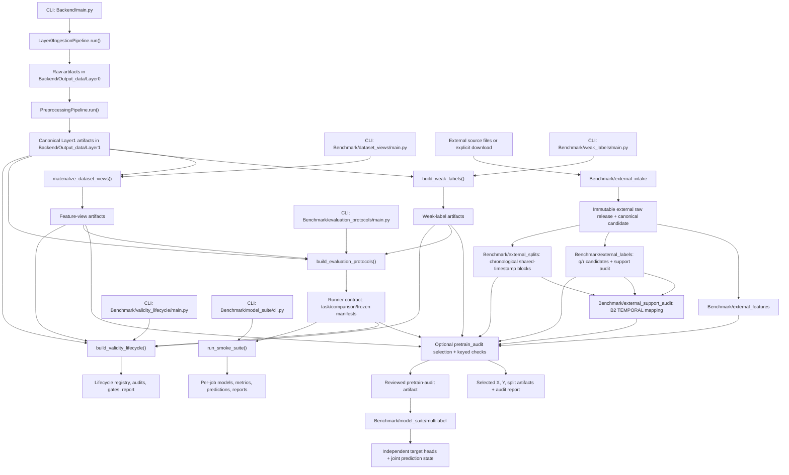
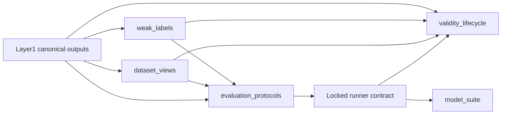
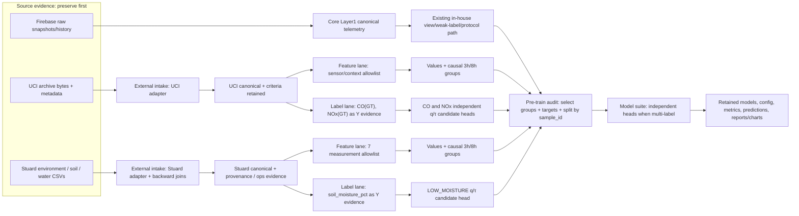
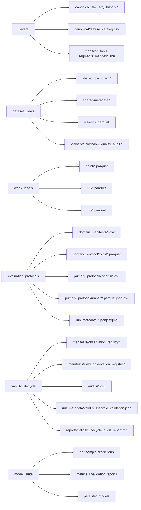

# Backend Pipeline Flow

## Purpose

This document describes the implemented handoffs from source ingestion to
canonical telemetry and from canonical telemetry into research evaluation.
The operational lane and benchmark lane are connected by artifacts but have
different owners and release gates.

## Naming note

- Older high-level docs often refer to the processing lane as `Core`.
- In the current workspace, that code lives under
  `Backend/Navigation/Core/`.
- When reading the implementation, follow the actual directory tree in
  the workspace.

## End-to-end flow

```mermaid
flowchart TD
    A["CLI: Backend/main.py"] --> B["Layer0IngestionPipeline.run()"]
    B --> C["Raw artifacts in Backend/Output_data/Layer0"]
    C --> D["PreprocessingPipeline.run()"]
    D --> E["Canonical Layer1 artifacts in Backend/Output_data/Layer1"]

    F["CLI: Benchmark/dataset_views/main.py"] --> G["materialize_dataset_views()"]
    E --> G
    G --> H["Feature-view artifacts"]
    H --> U["Optional pretrain_audit selection + keyed checks"]

    X["External source files or explicit download"] --> Y["Benchmark/external_intake"]
    Y --> Z["Immutable external raw release + canonical candidate"]
    Z --> W["Benchmark/external_features"]
    Z --> WL["Benchmark/external_labels: q/τ candidates + support audit"]
    Z --> ES["Benchmark/external_splits: chronological shared-timestamp blocks"]
    WL --> SA["Benchmark/external_support_audit: B2 TEMPORAL mapping"]
    ES --> SA
    WL --> SA
    W --> U
    WL --> U
    ES --> U
    SA --> U

    I["CLI: Benchmark/weak_labels/main.py"] --> J["build_weak_labels()"]
    E --> J
    J --> K["Weak-label artifacts"]
    K --> U

    L["CLI: Benchmark/evaluation_protocols/main.py"] --> M["build_evaluation_protocols()"]
    E --> M
    H --> M
    K --> M
    M --> N["Runner contract: task/comparison/frozen manifests"]
    N --> U
    U --> V["Selected X, Y, split artifacts + audit report"]

    R["CLI: Benchmark/validity_lifecycle/main.py"] --> S["build_validity_lifecycle()"]
    N --> S
    E --> S
    H --> S
    K --> S
    S --> T["Lifecycle registry, audits, gates, report"]

    O["CLI: Benchmark/model_suite/cli.py"] --> P["run_smoke_suite()"]
    N --> P
    P --> Q["Per-job models, metrics, predictions, reports"]

    U --> U2["Reviewed pretrain-audit artifact"]
    U2 --> ML["Benchmark/model_suite/multilabel"]
    ML --> ML2["Independent target heads + joint prediction state"]
```

## What each stage owns

- `Backend/main.py`
  - orchestrates Layer0 and Layer1 only
  - does not run benchmark lanes
- `Backend/Navigation/Core/layer0`
  - fetches or loads raw telemetry
  - decides sync behavior
  - persists immutable evidence
- `Backend/Navigation/Core/layer1`
  - builds canonical telemetry history
  - attaches continuity and temporal fields
  - writes reports and compatibility outputs
- `Backend/Benchmark/dataset_views`
  - builds feature matrices and an additive row-identified superset from canonical Layer1
- `Backend/Benchmark/weak_labels`
  - builds label authority from canonical Layer1
- `Backend/Benchmark/external_labels`
  - builds source-specific external q/τ candidate labels from allowlisted
    measurements and keeps all candidate assignments separate from features;
    UCI candidates are scoped to timestamps before 2005-03-01 while raw and
  canonical intake retain the complete source file
- `Backend/Benchmark/external_splits`
  - creates an immutable chronological 70/15/15 partition over linked UTC
    timestamps; shared environment/meter readings stay within one block
- `Backend/Benchmark/external_support_audit`
  - applies the user-selected B2 TEMPORAL support mapping to every external
    q/τ candidate and reports class, event, and episode-cluster support by
    partition; it does not authorize model fitting
- `Backend/Benchmark/evaluation_protocols`
  - freezes benchmark framing into a runner contract
- `Backend/Benchmark/validity_lifecycle`
  - re-audits the locked benchmark sample universe as lifecycle
    evidence for `E1`, `E2`, and `E3`
  - does not create new train/validation/test splits
- `Backend/Benchmark/model_suite`
  - trains and evaluates models from the locked runner contract
  - stores test-set confusion and ROC/PR charts from retained predictions
  - provides an additive independent-head runner for multi-label audit outputs
- `Backend/Benchmark/pretrain_audit`
  - selects explicit feature groups from a registered superset
  - checks sample-key coverage across features, labels, and protocol splits
  - reports missingness and target support before model fit without changing
    existing `evaluation_protocols` consumers

## Benchmark Block Diagram

```mermaid
flowchart LR
    A["Layer1 canonical outputs"] --> B["dataset_views"]
    A --> C["weak_labels"]
    A --> D["evaluation_protocols"]
    B --> D
    C --> D
    D --> E["Locked runner contract"]
    E --> F["validity_lifecycle"]
    E --> G["model_suite"]
    B --> F
    C --> F
    A --> F
```

## Data processing and target generation at a glance

The external pack follows two parallel authorities after intake: the feature
lane builds X from observed sensor/context measurements, while the label lane
builds candidate Y from its profile's target evidence. The lanes only meet at
the pre-train audit through `sample_id`.

```mermaid
flowchart LR
    subgraph RAW["Source evidence: preserve first"]
      F0["Firebase raw snapshots/history"]
      U0["UCI archive bytes + metadata"]
      S0["Stuard environment / soil / water CSVs"]
    end
    F0 --> FC["Core Layer1 canonical telemetry"]
    U0 --> UI["External intake: UCI adapter"]
    S0 --> SI["External intake: Stuard adapter + backward joins"]
    UI --> UC["UCI canonical + criteria retained"]
    SI --> SC["Stuard canonical + provenance / ops evidence"]

    UC --> UF["Feature lane: sensor/context allowlist"]
    SC --> SF["Feature lane: 7 measurement allowlist"]
    UF --> UX["Values + causal 3h/8h groups"]
    SF --> SX["Values + causal 3h/8h groups"]

    UC --> UL["Label lane: CO(GT), NOx(GT) as Y evidence"]
    SC --> SL["Label lane: soil_moisture_pct as Y evidence"]
    UL --> UY["CO and NOx independent q/τ candidate heads"]
    SL --> SY["LOW_MOISTURE q/τ candidate head"]

    UX --> AUD["Pre-train audit: select groups + targets + split by sample_id"]
    SX --> AUD
    UY --> AUD
    SY --> AUD
    FC --> FV["Existing in-house view/weak-label/protocol path"]
    FV --> AUD
    AUD --> FIT["Model suite: independent heads when multi-label"]
    FIT --> OUT["Retained models, config, metrics, predictions, reports/charts"]
```

### Read the diagram with these boundaries

- Raw intake and canonicalization preserve source fields; they do not create
  benchmark labels or model features.
- A field can be retained in canonical data yet forbidden in X. UCI analyzer
  criteria are the current example: used for candidate Y, excluded from X.
- Features, labels, and split manifests stay physically separate and are
  reconciled by stable `sample_id` in the audit.
- The candidate-label profile is currently configured by dataset ID. The
  claim inventory informs human review, but approved claim IDs are not yet an
  enforced runtime gate. Candidate output is not a frozen target release.
- The diagram includes an optional pre-train audit. Existing frozen in-house
  protocol-to-model consumers have not all been migrated to require it.

This is the current connection order:

- `dataset_views` owns feature materialization.
- `pretrain_audit` owns optional explicit group selection and keyed pre-fit checks.
- `weak_labels` owns label authority.
- `evaluation_protocols` owns benchmark framing and runner-facing
  manifests.
- `validity_lifecycle` owns pre-training readiness and ambiguity audits
  on top of that frozen contract.
- `model_suite` owns actual model fitting and held-out evaluation.

## Handoff files that matter

- Layer0 -> Layer1
  - `Backend/Output_data/Layer0/Firebase_data/history/**`
  - `Backend/Output_data/Layer0/Firebase_data/new_raw/**`
- Layer1 -> benchmark lanes
  - `Backend/Output_data/Layer1/canonical/telemetry_history.csv|parquet`
  - `Backend/Output_data/Layer1/canonical/feature_catalog.csv`
  - `Backend/Output_data/Layer1/manifest.json`
  - `Backend/Output_data/Layer1/segments/segments_manifest.json`
- `dataset_views` -> `evaluation_protocols`
  - `artifacts/<run_id>/shared/row_index.*`
  - `artifacts/<run_id>/views/<view_id>/X.parquet`
  - `artifacts/<run_id>/views/<view_id>/feature_columns.json`
- `weak_labels` -> `evaluation_protocols`
  - `point/point_labels_train.parquet`
  - `v2/v2_same_y_labels.parquet`
  - `v2/v2_temporal_labels_*.parquet`
  - `v6/*.parquet`
- `evaluation_protocols` -> `model_suite`
  - `primary_protocol/runner/task_view_registry.csv`
  - `primary_protocol/runner/task_training_manifest.parquet`
  - `primary_protocol/runner/comparison_training_manifest.parquet`
  - `primary_protocol/runner/frozen_target_manifest.parquet`
  - `primary_protocol/runner/runner_contract.json`
- `evaluation_protocols` -> `validity_lifecycle`
  - `run_metadata/run_manifest.json`
  - `run_metadata/protocol_validation_report.json`
  - `domain_manifests/deployment_domains.csv`
  - `primary_protocol/runner/task_view_registry.csv`
  - `primary_protocol/runner/task_training_manifest.parquet`
  - `primary_protocol/runner/comparison_training_manifest.parquet`
  - `primary_protocol/runner/frozen_target_manifest.parquet`
- `dataset_views` -> `validity_lifecycle`
  - `shared/metadata.parquet`
  - `shared/row_index.parquet`
  - `views/v1_sensor_row/X.parquet`
  - `views/v2_* / window_quality_audit.parquet`
- `weak_labels` -> `validity_lifecycle`
  - `point/point_labels_train.parquet`
  - `point/point_labels_detailed.parquet`
  - `point/point_evidence_flags.parquet`
  - `v2/v2_same_y_labels.parquet`
  - `v2/v2_temporal_evidence_*.parquet`
  - `v2/v2_temporal_labels_*.parquet`

## Stage Output Map

```mermaid
flowchart LR
    A["Layer1"] --> A1["canonical/telemetry_history.*"]
    A --> A2["canonical/feature_catalog.csv"]
    A --> A3["manifest.json + segments_manifest.json"]

    B["dataset_views"] --> B1["shared/row_index.*"]
    B --> B2["shared/metadata.*"]
    B --> B3["views/<view_id>/X.parquet"]
    B --> B4["views/v2_*/window_quality_audit.*"]

    C["weak_labels"] --> C1["point/*.parquet"]
    C --> C2["v2/*.parquet"]
    C --> C3["v6/*.parquet"]

    D["evaluation_protocols"] --> D1["domain_manifests/*.csv"]
    D --> D2["primary_protocol/folds/*.parquet"]
    D --> D3["primary_protocol/cohorts/*.csv"]
    D --> D4["primary_protocol/runner/*.parquet|json|csv"]
    D --> D5["run_metadata/*.json|csv|md"]

    E["validity_lifecycle"] --> E1["manifests/observation_registry.*"]
    E --> E2["manifests/view_observation_registry.*"]
    E --> E3["audits/*.csv"]
    E --> E4["run_metadata/validity_lifecycle_validation.json"]
    E --> E5["reports/validity_lifecycle_audit_report.md"]

    F["model_suite"] --> F1["per-sample predictions"]
    F --> F2["metrics + validation reports"]
    F --> F3["persisted models"]
```

## Read order for a new maintainer

1. `Backend/main.py`
2. `Backend/Navigation/Core/layer0/FLOW.md`
3. `Backend/Navigation/Core/layer1/FLOW.md`
4. `Backend/Benchmark/dataset_views/FLOW.md`
5. `Backend/Benchmark/weak_labels/FLOW.md`
6. `Backend/Benchmark/evaluation_protocols/FLOW.md`
7. `Backend/Benchmark/validity_lifecycle/FLOW.md`
8. `Backend/Benchmark/model_suite/FLOW.md`
9. `Backend/Benchmark/BENCHMARK_TO_MODEL_SUITE_SPEC.md`

## Practical documentation convention

- `README.md`
  - boundary, scope, and artifact summary
- `FLOW.md`
  - implemented control flow
  - entrypoint
  - input/output
  - module map
  - Mermaid sequence or data-flow
  - "read this next" guide

This convention fits the repository well because the system is clearly
split into lanes, while each lane still contains enough internal modules
and artifact contracts to require a more implementation-oriented
companion document.
